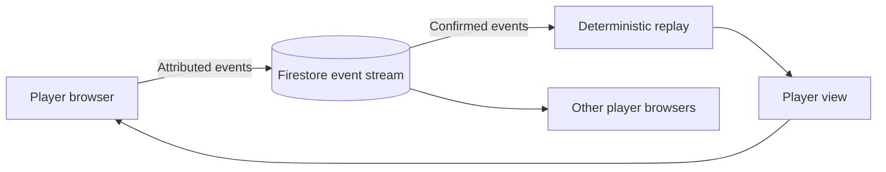

# Deep Sea — MVP Design

## Status and scope

Deep Sea is a turn-based web game for friends playing from separate devices. Its design must keep every browser in agreement about the board, preserve decisions across interruptions, and make the shared oxygen supply and individual choices understandable. This document proposes the MVP design; the application has not been implemented. [RULES_SUMMARY.md](RULES_SUMMARY.md) defines the game rules and identifies details awaiting confirmation.

Support 2–6 human players, each using their own browser. Players create a room, invite friends, ready up, play three dives, review scores, and start another game. Include reload/reconnection, understandable turn history, and keyboard/touch operation on phones and desktops.

Exclude bots, matchmaking, accounts beyond anonymous sessions, chat, spectators as a product feature, shared-table controllers, Boost rules, and ranked play. These exclusions are MVP design proposals, not restrictions on the long-term vision.

## Architecture and trust

A game consists of a small sequence of player decisions. Store those decisions as immutable events and derive the board by replaying them in a defined order. This gives every browser the same source of truth, makes interrupted games recoverable, and allows rule failures to be reproduced from their history.

Use SvelteKit with TypeScript, Vite, and the static adapter for the browser application. Separate the interface, event repository, pure rules reducer, and player-view selectors. The reducer owns legality and state transitions; components render its output and submit actions. An ordered roster supports 2–6 seats, while the active-diver set changes as players return.

Firebase anonymous Authentication identifies a browser's seat without account registration. Firestore stores and distributes events, and GitHub Pages serves the static application. This MVP assumes trusted players in invited groups. Game legality runs in the clients; confidential hidden state and adversarial fairness are outside that trust model.

The full stream and seed reveal treasure values and future random outcomes to a modified client. Normal views must hide unrevealed values from **every** player, even their owner. UI filtering is not a security boundary. Anonymous identity survives ordinary reloads, but clearing browser storage can lose the seat; cross-device identity recovery is outside this MVP.

Firestore rules should require authentication, own-UID attribution, a bounded valid event envelope, and a server timestamp, and deny updates, deletes, and unrelated paths. Reducers validate membership, phase, and moves. A nonmember can still submit self-attributed events; invalid events are ignored deterministically. Invite links are room locators, not access-control secrets. Membership-restricted reads, server-side moves, or concealed randomness would require revisiting this architecture before promising those features.

## Room and player flow

1. Enter a display name and create or join through an invite URL. Use a randomly generated room ID; creation writes one fixed `created` event ID so concurrent attempts cannot silently share a room.
2. Host occupies seat one. Subsequent valid joins fill seats two through six in canonical event order. Display name is presentation; UID owns the seat.
3. Players can leave or change readiness before play. Membership changes clear readiness. Host selects the initial starter so the group can apply the swimming rule, then starts once 2–6 current players are ready.
4. Freeze seats and circular turn order at start. Reject late joins and departures as game actions. A disconnected player's seat is retained; their turn waits without consuming oxygen on a wall-clock timer.
5. Show a dive summary between dives. Any seated player can request continuation once cleanup choices are complete; the reducer derives the next starter. No continuously connected host is needed after the game starts.
6. End with the score breakdown and winner or shared winners. “Play again” creates a fresh room and invite, preserving the completed game's history.

If a player cannot return, the group can start a new room; the MVP has no host-controlled move substitution or automatic forfeits. Offline clients may inspect cached state, but cannot initiate new actions until synchronized. Pending submissions show as pending rather than confirmed turns.

## State and event contract

Canonical data lives at `games/{gameId}/events/{eventId}`. No mutable score or board document is required. Maintain a single chronological reducer for lobby and gameplay so future membership events cannot retroactively change earlier turns.

Each envelope contains `schemaVersion`, `reducerVersion`, `rulesetVersion`, `type`, `payload`, `actorUid`, `clientId`, `clientSeq`, and server-assigned `createdAt`. Use a per-tab random client ID plus monotonic sequence for event IDs; persist the exact ID and payload before submission and reuse both on retry. Separate client IDs prevent two tabs sharing a player identity from allocating the same sequence of event IDs.

Every gameplay action asserts `diveNumber`, `turnNumber`, `phase`, and `expectedActionId` (the last accepted state-changing event). Compare confirmed events by the full timestamp's seconds and nanoseconds, then bytewise document ID. Preserving timestamp precision and using locale-independent comparison gives every browser the same ordering. Unacknowledged timestamps never establish canonical order; rebuild from confirmed history when late events arrive. First valid event at its replay position wins; stale competitors produce a visible conflict with no partial mutation.

If a retry finds its immutable event already present, compare the stored actor, versions, type, and payload with the persisted submission and acknowledge the match. Never overwrite it to refresh its timestamp; report an ID collision if the contents differ.

Invalid envelopes, duplicate IDs, wrong actors, and illegal actions produce diagnostics. Unsupported versions block further local interaction and request a reload/update. Cached projections are disposable; cache keys include game and protocol versions. Replay the full room stream on reconnect; the short, bounded game does not require incremental replay checkpoints.

| Event | Payload and reducer responsibility |
| --- | --- |
| `game/created` | Host name, game ID, versions; establish lobby. |
| `player/joined`, `player/left`, `player/ready` | Validate UID and lobby state; allocate/release seats or update readiness. Host departure closes an unstarted room. |
| `game/started` | Seed and selected starter; freeze the ready roster and initialize the component manifest. |
| `turn/rolled` | Continue/return choice and expected state; charge oxygen, lock direction, derive dice, and move atomically. |
| `treasure/chosen` | Pass, pick up, or drop a specific carried unit; resolve the landing decision and finish the turn. |
| `loss/ordered` | Stranded owner supplies a permutation of carried unit IDs, in the cleanup order defined by the rules; no fabricated, omitted, or split units. |
| `dive/continued` | After cleanup, advance the dive with the derived starter and retained board. No new full-board shuffle. |

Returning directly to the submarine finishes the turn inside `turn/rolled`; there is no treasure-choice event aboard. If oxygen was exhausted, finish the active diver's remaining landing decision before entering cleanup. When no stranded cargo needs ordering, resolve cleanup automatically. After the final cleanup, derive game completion without requiring another player event.

The state includes roster/order, active seat, dive/turn/phase, remaining oxygen, an exhaustion flag, path spaces, diver locations/directions, carried units, banked tiles, cleanup queue, and dive results. Distinguish `not-yet-dived`, `underwater`, and `returned`; a player who has not left the submarine still needs their first turn.

The first movement of a dive is outward. Initial setup and each accepted turn completion prepare the next active diver's oxygen charge for display; `turn/rolled` commits that charge exactly once together with direction and movement. The UI shows the post-charge oxygen available for the decision, including a last-turn notice, without requiring a separate bookkeeping click.

Use stable opaque IDs for the 32 original tiles and for path spaces. A treasure unit contains one or more tile IDs; carrying cost uses unit count while scoring uses tile values. Keep identities and values separate so IDs and accessible labels do not reveal concealed values. Validate conservation across path, cargo, cleanup, and banked zones after every accepted action.

## Randomness and visible information

Commit one seed at game start and version the PRNG/shuffle algorithm. Use separate deterministic streams for initial per-level shuffles and dice, with each dice pair addressed by dive and turn. Rejected actions never consume randomness; reloads never reroll. Production generates the seed with browser cryptographic randomness; tests use fixed seeds. A public seed provides repeatability, not cheat-resistant unpredictability.

Selectors expose the public board, cargo quantities and visible levels, directions, oxygen, whose turn it is, and revealed banked scores. They exclude unrevealed numeric values, seed, future dice, and internal IDs encoding values from rendered text, labels, and ordinary game history. These fields remain technically inspectable in full replay state under the chosen trust model.

## Interface

Provide a room screen, shared dive board, dive summary, and final results. Keep oxygen, turn status, and available actions easy to find. A clear return/continue choice precedes the roll; show the outcome and then offer legal landing actions. Display cargo units distinctly from their constituent tile counts.

Use original simple graphics, labeled controls, visible focus, color-independent diver markers, and reduced-motion support. On small screens, use a controlled scrollable path with a persistent turn/action area so all 32 spaces remain readable and actions stay within reach.

## Implementation and verification strategy

Build small playable slices that exercise a real browser action through persistence and replay to a visible result on another device. Each slice includes its UI, rules, persistence, and tests in the same PR:

1. Static shell, Nix-managed verification, emulator connection, anonymous identity, and two-browser room creation/join/readiness.
2. Initial dive setup and one complete turn observed by both browsers.
3. Full dive, all treasure choices, lost-cargo ordering, scoring, and next-dive transition.
4. Complete three-dive game, replay/reconnection, and six-player conflicts.
5. Phone/desktop accessibility and verified retained deployment previews.

Resolve the rulebook checks in `RULES_SUMMARY.md` before coding affected edge cases. Freeze their decisions under `rulesetVersion`; do not silently change how existing rooms replay.

Use Vitest for reducer legality, conservation, exact seed fixtures, phase transitions, zero movement, oxygen exhaustion, lost stacks, starter selection, and ties. Firestore emulator tests cover allowed attribution and denied mutation/unauthenticated access. Repository tests cover full-precision ordering, duplicate retries, multi-tab IDs, cache recovery, and malformed events.

Playwright uses isolated browser contexts against Auth/Firestore emulators. Prove both the actor's result and other players' converged view. Include two-player complete games, a six-player game, a race for the sixth seat, conflicting turn submissions, lost acknowledgements, reconnect during cleanup, hidden-value rendering checks, and wrong-version blocking. Use semantic assertions before screenshots, fixed seeds/locale/fonts/viewports, and no production data. Generate scenario walkthroughs from test steps; pin the browser and rendering environment before choosing screenshot tolerances. Keep timeouts and screenshot tolerances in one shared configuration so helpers cannot silently change the verification contract.

Retain the existing prompt hook. Add game verification alongside it as code arrives: type checks, unit tests, emulator rules tests, browser scenarios, and production build. CI runs the same commands. Prompt logging is checked against the staged index by the local hook; CI should compare the PR's prompt log with its base rather than expecting a staged local change.

## Tooling and deployment

Continue using `flake.nix`, `flake.lock`, npm, and `package-lock.json`. Add required system tools such as the emulator JDK and Nix-compatible browser dependencies through the flake when the corresponding implementation arrives. Pin Firebase CLI and test libraries in npm; do not install tools globally. The current Node version must be checked against selected dependencies before scaffolding, and any upgrade belongs in the flake.

Publish the main build at `/deepsea/` and retained PR previews at `/deepsea/pr<N>/`. Handle base paths for invites, assets, and navigation. Build and publish the exact tested PR head for same-repository branches; retain other previews and serialize publication to avoid concurrent overwrites. Fork PRs run checks without deployment credentials.

Use a dedicated Deep Sea Firebase project with isolated preview and production game namespaces or projects. Emulator tests run against local data. Provisioning and deployment configuration must preserve those boundaries so testing and preview play cannot alter production games.
