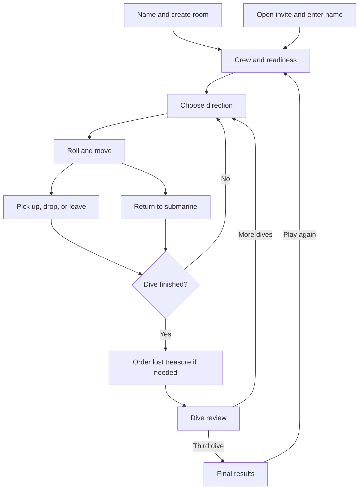
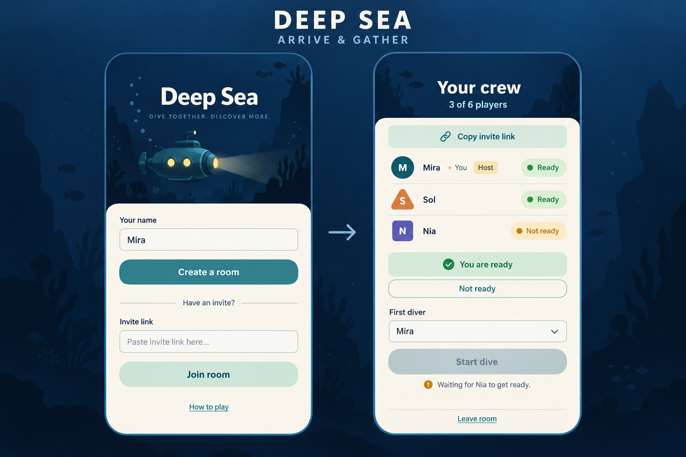
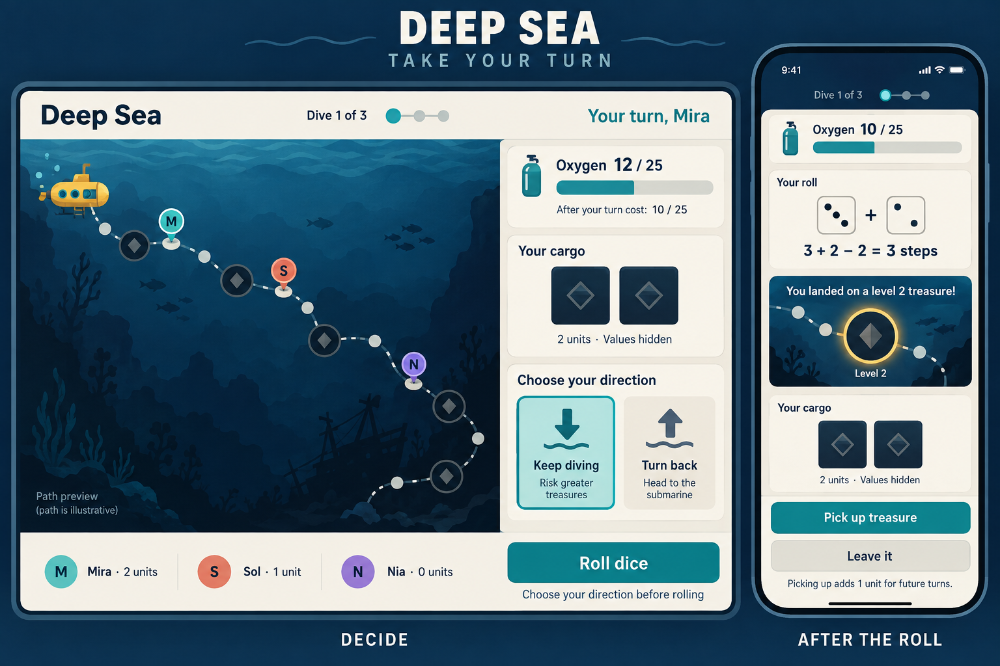
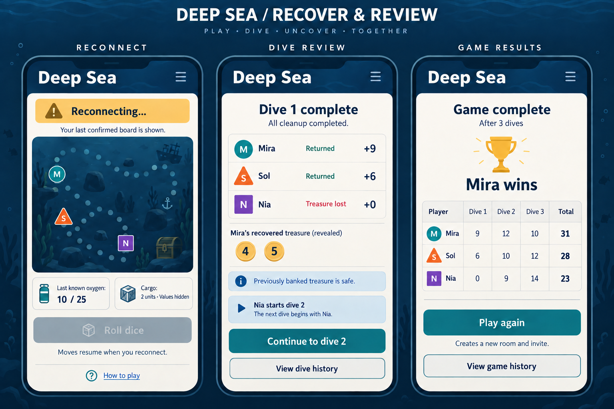

# Deep Sea — UX Design

## Experience and scope

Friends join a room from their own browsers and explore the same underwater path. At any moment, a player should understand whose turn it is, how much oxygen remains, what they are carrying, and what choice they can make next.

This is a proposed experience for the multiplayer MVP in [MVP_DESIGN.md](MVP_DESIGN.md). Game behavior follows [RULES_SUMMARY.md](RULES_SUMMARY.md), including its outstanding rulebook checks. The generated mockups explore layout and hierarchy; they are not working screens or exact board fixtures. The text below defines behavior when an illustrative detail is ambiguous.

## Use cases

| Player need | Entry point | Successful outcome |
| --- | --- | --- |
| Gather friends | Home or invite link | Join the intended room, see the crew, and know who is ready. |
| Learn while playing | First dive or rules help | Understand the current decision without leaving the game. |
| Take a turn | Current-player announcement | Choose direction, roll once, and resolve the landing space. |
| Follow another diver | Board between turns | See confirmed movement and oxygen changes without interacting. |
| Return or lose treasure | End of a dive | Understand what was banked or lost and any required cleanup choice. |
| Recover a connection | Open game after interruption | Return to the same seat and latest confirmed state. |
| Finish and play again | Final score screen | Understand the result and create a fresh room for another game. |

“Play again” creates a new room. The diagram's return to the lobby does not reset the completed room. Connection recovery can occur during any active-game state.

## 1. Arrive, invite, and ready up

**Example:** Mira creates a room and shares its invite with Sol and Nia. The crew screen shows three occupied seats, with Nia still unready.

Home asks for a name and offers **Create a room**. A second path accepts an invite link. Opening an invite directly skips pasting and asks only for a name before **Join room**. Keep the room context visible so players know which invitation they are accepting. There is no email, password, or account-registration form.

Each lobby row shows the player's name, distinct diver marker, seat, and readiness. Mark the local player as “You” and the creator as “Host.” **Copy invite link** provides a visible and announced “Link copied” confirmation; if clipboard access fails, reveal a selectable link.

Players control only their own readiness. The host selects **First diver**, with help explaining the swimming rule, and starts when all occupied seats are ready and at least two are present. Keep the disabled start button visible with the reason beside it. Guests see “Waiting for the host to start” once ready. A join or departure clears readiness and announces the roster change.

**Join failures:** show “This room is full,” “This game has already started,” or “We couldn't find that room,” with **Try another invite** and **Create a room**. Losing a race for the final seat must not leave a player appearing to have joined. Leaving the lobby requires confirmation for the host because it closes that room; explain this before confirming.

## 2. Read the board and take a turn

**Example:** Mira carries two units. Oxygen is 12 before her turn cost and will be 10 after it. She chooses to keep diving, rolls 3 and 2, and moves three counted spaces. Her landing decision is whether to collect the treasure there.

The two screens show successive phases, not conflicting simultaneous state. Before committing the roll, label the oxygen preview explicitly: **Oxygen 12 / 25** and **After your turn cost: 10 / 25**. After confirmation, show **Oxygen 10 / 25**. Never visually subtract oxygen twice.

The main board has a single path from the submarine into deeper water. Divers use both a shape and a name/initial; facing and a text label show whether they are diving or returning. A roster lists cargo unit counts and who is aboard. Selecting a diver locates them on the path without making a game move.

Cargo shows concealed treasure units, their visible levels, and the carrying cost. A stack is presented as one selectable unit with its tile count. No carried or underwater numerical value appears, even to its owner; do not offer a peek interaction. Previously banked scores may be visible.

### Direction and roll

On a player's turn, bring the action area into view and announce “Your turn.” Show **Keep diving** and **Turn back** as a direction choice before **Roll dice**. Continuing is the initial selection. Once returning, replace the chooser with “Returning to the submarine”; on the first departure, show “Diving out.” The roll is the commitment point.

While saving, disable repeat submission and label the action **Sending…**. Display dice only after the roll is confirmed. Show the two dice, cargo deduction, and resulting movement together. Animate movement briefly, respecting skipped occupied spaces, with an equivalent text description. Reduced-motion mode moves directly to the result. Never offer another roll because animation was skipped or the page reloaded.

### Landing choice

| Landing state | Controls and explanation |
| --- | --- |
| Treasure space | **Pick up treasure** or **Leave it**. Explain that pickup adds one carried unit for future turns. |
| Blank space with cargo | Select one carried unit, then **Drop selected treasure**, or **Leave it**. Selection can change before confirmation. |
| Blank space without cargo | **End turn**, with “Nothing to pick up or drop here.” |
| Zero movement | Explain “Your cargo prevents movement.” Offer the legal choice on the current space. |
| Submarine | Complete the return automatically; show “Back aboard. Your dive is complete.” |

A pickup/drop/pass completes the turn once confirmed; do not add a second redundant confirmation. Dropping a stack always selects the whole unit. Until the dive ends, a returned player can inspect the board and follow the others, but cannot dive again.

When the turn cost exhausts oxygen, show **Last turn of this dive** and “Finish your move and landing choice.” Do not end the dive before that choice resolves. Help explains oxygen as a shared resource consumed by turns, with no elapsed-time countdown or survival estimate.

## 3. Recover and review

### Connection recovery

An interrupted client keeps the last confirmed board visible with **Reconnecting…** and **Last known oxygen**. Disable game-changing controls. Other connected players may still act when legal; this message must not claim the whole game is paused.

After reconnecting, restore the same seat, update the board, and announce the current turn. If a move was pending, first determine whether it already succeeded. Do not ask for another roll while its result is uncertain. For a stale submission, say “The game changed before your move arrived. Review the current turn.” Clear unsubmitted selections before enabling a fresh action.

If the browser's saved identity is gone, explain that it cannot reclaim an active seat automatically. Offer a new room rather than silently joining as the old player. If an app version cannot read the game, block moves and show **Reload to update** with a plain-language explanation.

### Lost-treasure cleanup

Before the dive review, each stranded player with cargo may need to order their lost units. Show “Choose the order of your lost treasure,” the concealed units, and a preview of their placement into stacks. Provide **Move earlier** and **Move later** controls so dragging is optional. **Confirm order** submits the complete ordering once; other players see “Waiting for Nia to order lost treasure.” Skip empty or choice-free cleanup steps automatically.

Cleanup does not reveal lost values. The detailed grouping and ordering behavior must follow the resolved rules baseline. If someone disconnects during their cleanup choice, retain it as pending and wait for them to reconnect.

### Dive review

For each player, show **Returned** or **Treasure lost**, the points gained this dive, and the cumulative banked score. Explain that previously banked treasure remains safe. Reveal only successfully returned treasure and allow players to inspect its score breakdown.

The mockup's abbreviated rows show dive gains: Mira gains 9, Sol 6, and Nia 0. On dive one, these also equal the cumulative totals. In subsequent dives, label **This dive** and **Total** separately. State who starts next. **Continue to dive 2** becomes available only after all cleanup resolves; any seated player can activate it. Completed dive details remain accessible through history if another player continues first.

### Final result and another game

After dive three, replace continuation with the full three-dive score table. State the winner, explain any tiebreak used, or announce shared winners. Do not force a sole winner in a remaining tie.

**Play again** creates a new room with the local display name prefilled, then returns to the invite/readiness flow. It does not move the other players automatically or erase the completed game. Keep **View game history** available from results.

## Layout, accessibility, and help

Desktop places the board beside cargo, roster, and actions. Phones keep a compact oxygen/turn header and an action area visible while the path scrolls independently. Provide **Find my diver** and **Show submarine**; avoid jumping the board while someone is inspecting it. Support six players through a compact expandable roster rather than shrinking touch targets.

Use native controls, visible keyboard focus, meaningful headings, at least 44 CSS-pixel touch targets, and text equivalents for icons and shapes. Verify text contrast in the implemented palette; the generated images do not certify accessibility. Announce confirmed turn, oxygen, connection, and result changes politely. Avoid reading every animated step aloud. Disabled controls need adjacent explanations.

**How to play** opens a dismissible panel without losing the current view or unsent direction selection. Its short sections cover turn order, oxygen cost, cargo, turning back, and safe return. Restore focus to the trigger when it closes. Help and move history never expose seeds, unrevealed values, raw event data, or backend terms.

## Review and acceptance scenarios

- Three people join from separate devices, resolve readiness, and start without assistance; guests cannot trigger host-only actions.
- Two and six players can identify all divers and the current action at phone and desktop sizes.
- A direction choice, roll, and landing action update the actor and other clients consistently, with no duplicate oxygen charge or reroll after reload.
- A full cargo stack can be dropped with keyboard controls, and an oxygen-exhausting turn completes before cleanup.
- A player reconnects during a turn or cleanup without a duplicate action; stale and incompatible states explain the next step.
- Dive totals, final totals, a tiebreak, and a shared victory are understandable from the screen and accessible text.
- No unrevealed numerical treasure values appear in the board, cargo, accessible labels, help, or ordinary history.

## Mockup assets

The three embedded sheets were generated with the built-in image generation tool. Their exact generation prompts are recorded in [docs/ux/IMAGE_PROMPTS.md](docs/ux/IMAGE_PROMPTS.md). The navy/ivory/teal treatment is a proposed visual direction, not a finalized art system. Board paths are illustrative; implement the complete rules-driven path and validate actual UI states with browser tests.
