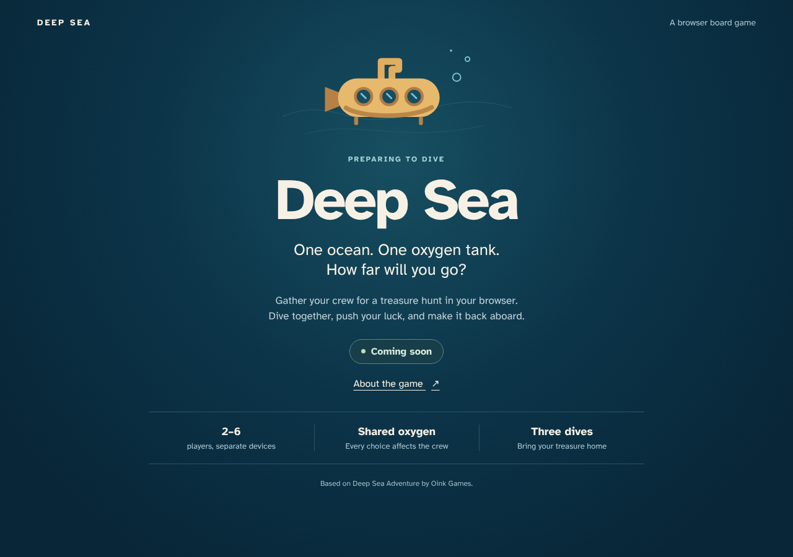
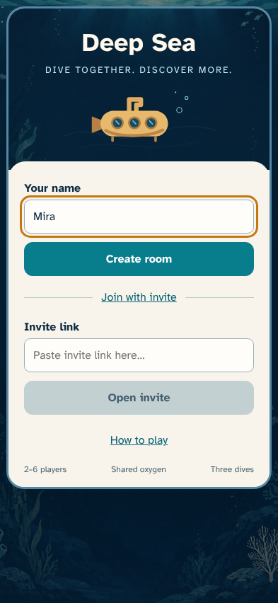
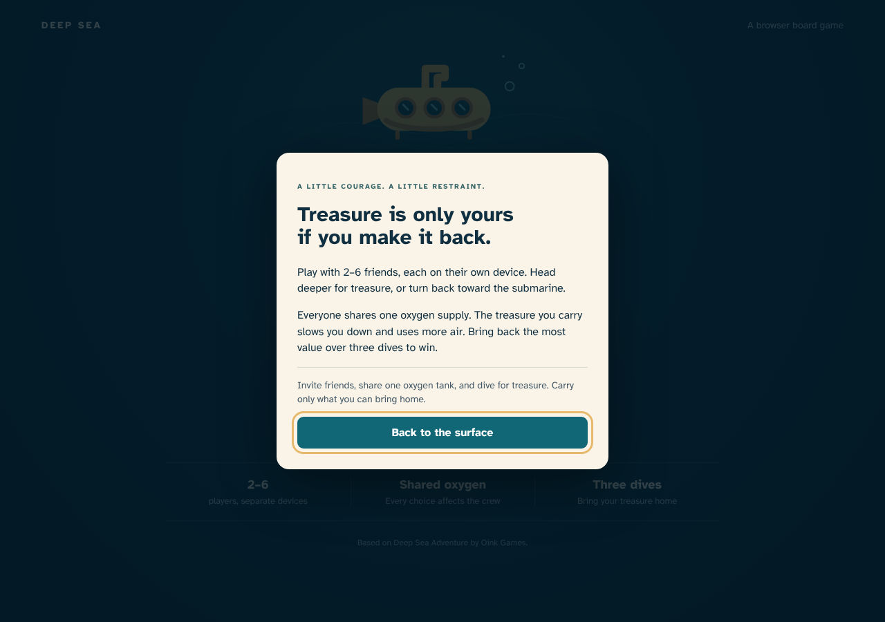
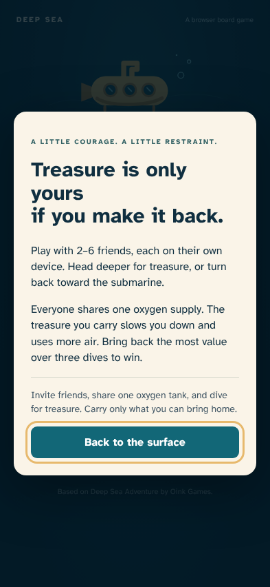
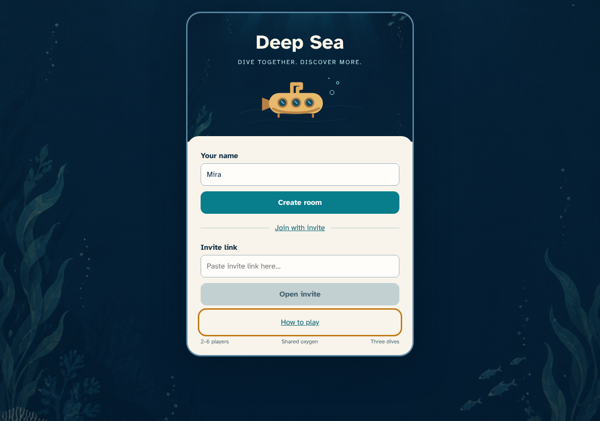
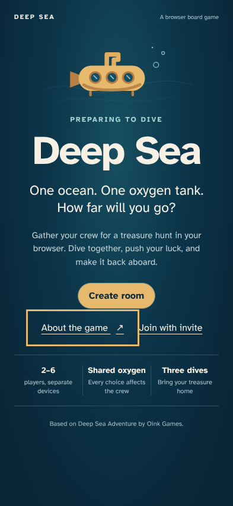

# Gather your crew

> Generated by TestSteps from the passing browser scenario. Do not edit manually.

A visitor opens the production-built splash screen, reads the game brief with the keyboard, and returns to the splash. No backend is required.

## The game is clearly marked as ready for room creation

- The page title and main heading identify Deep Sea.
- Gather your crew and the three game facts are visible.
- The hydrated About the game button is available; room creation is available.

## A keyboard user can learn the game

- An accessible dialog explains separate-device play and the shared oxygen supply.
- The brief explains treasure risk in player language.
- The close control receives focus and is keyboard operable.

## Closing the brief restores the visitor’s place

- Escape closes the dialog and restores focus to About the game.
- The create-room link remains visible.

