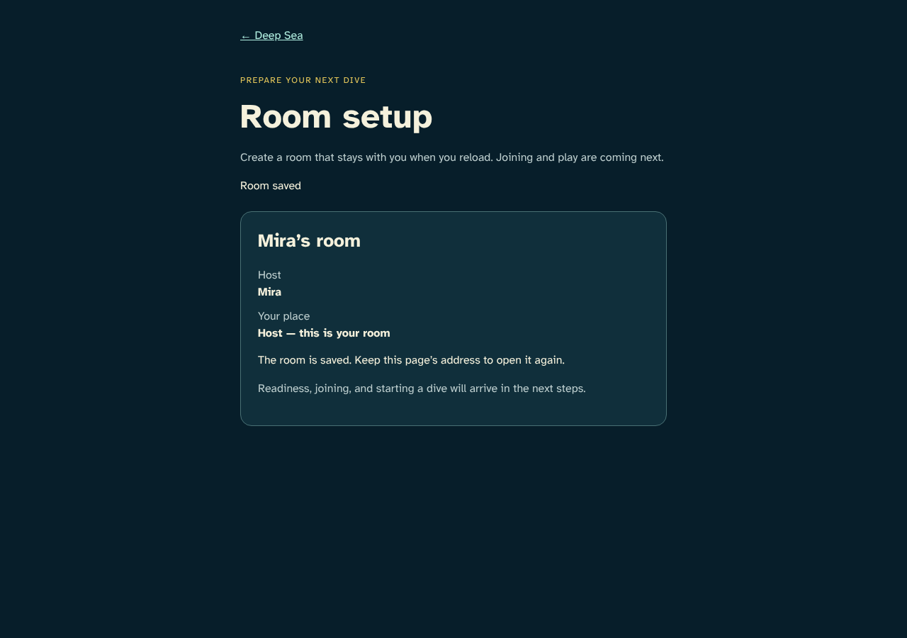
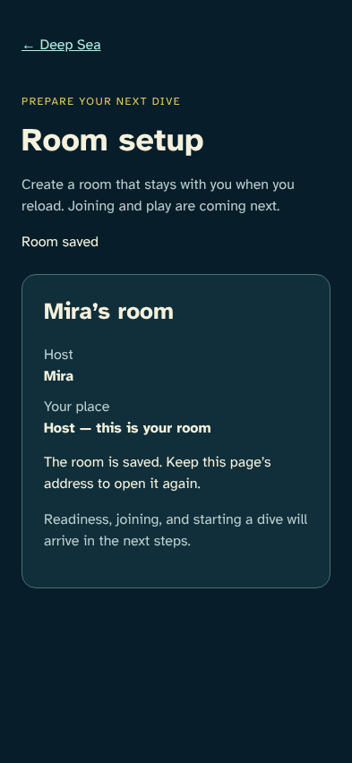
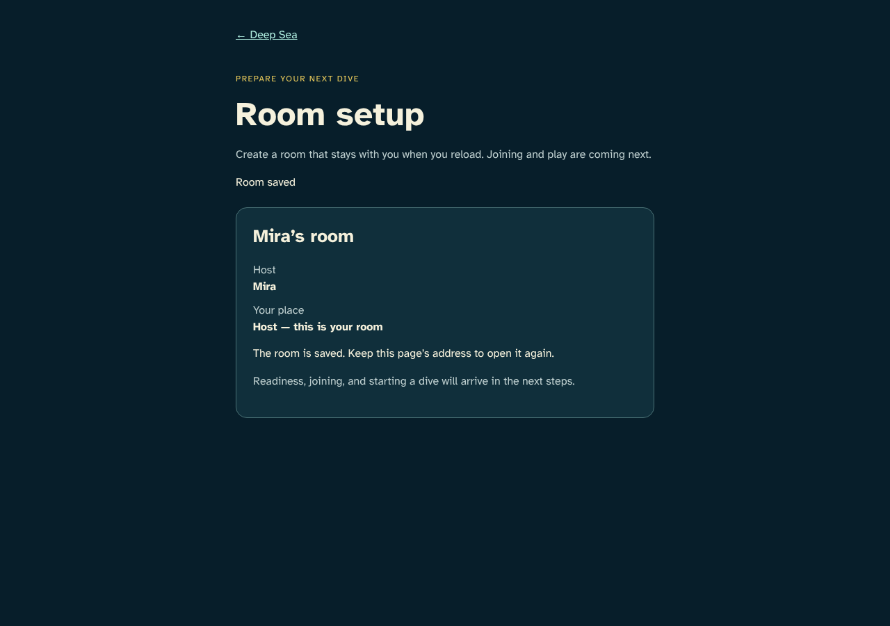
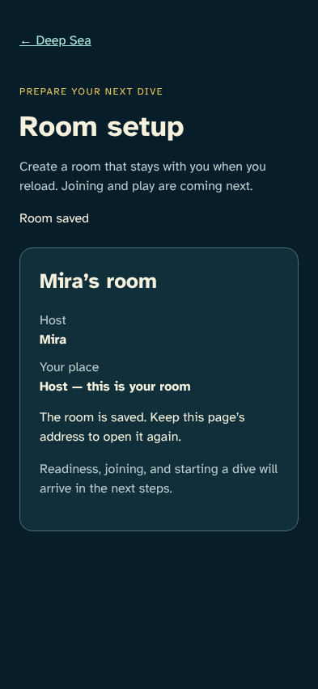
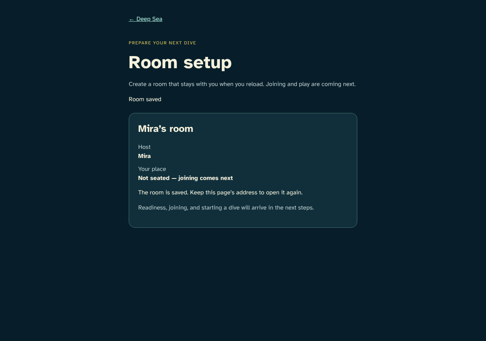
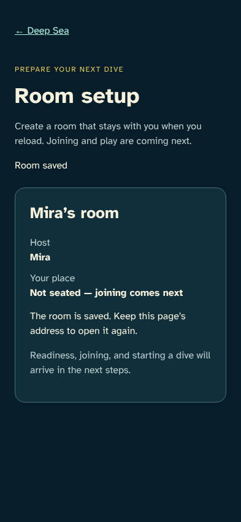

# A room that survives reload

> Generated by TestSteps from the passing browser scenario. Do not edit manually.

Mira creates a real persisted room and returns to the same anonymous identity after reload.

## host

Mira creates a real persisted room and returns to the same anonymous identity after reload.

## The host sees a saved room

- The confirmed room belongs to Mira and retains the host identity.

## Reload restores the confirmed room and owner

- Reload keeps the host identity and room with no duplicate creation or pending action.

## guest

An independently authenticated browser reads the same confirmed room without claiming a seat.

## Another browser sees the same room

- The host name matches while the second anonymous identity has no seat.

