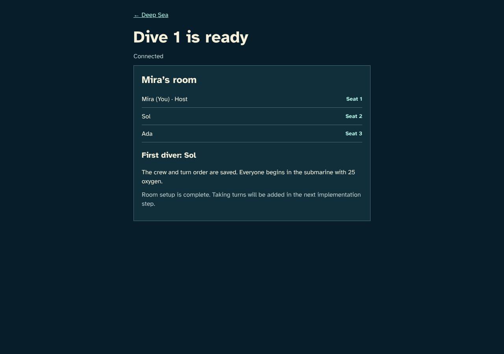
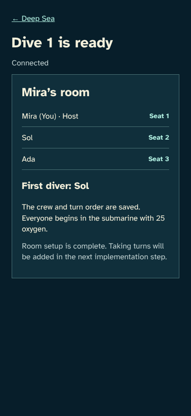
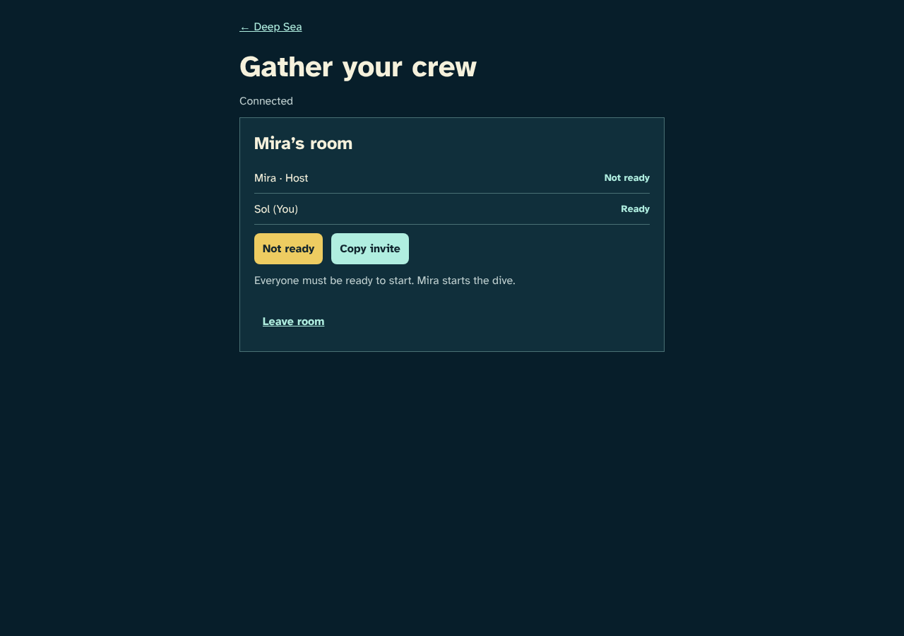
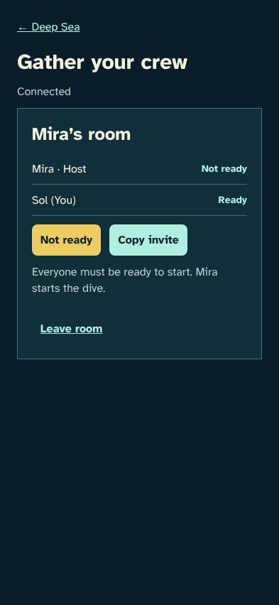
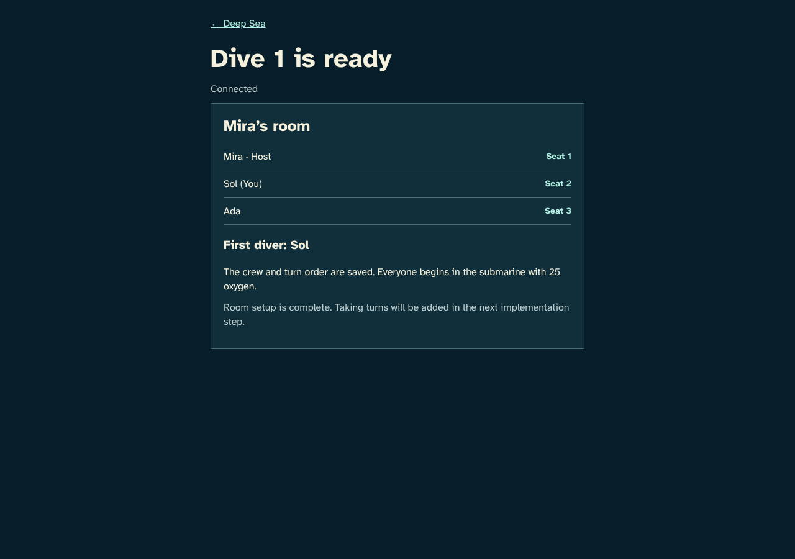
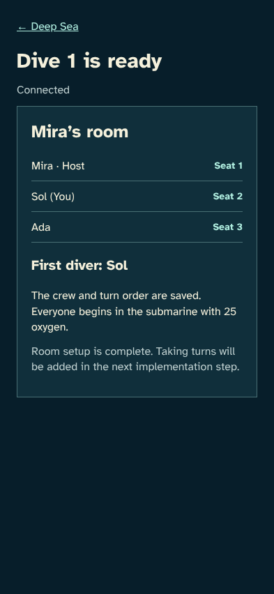
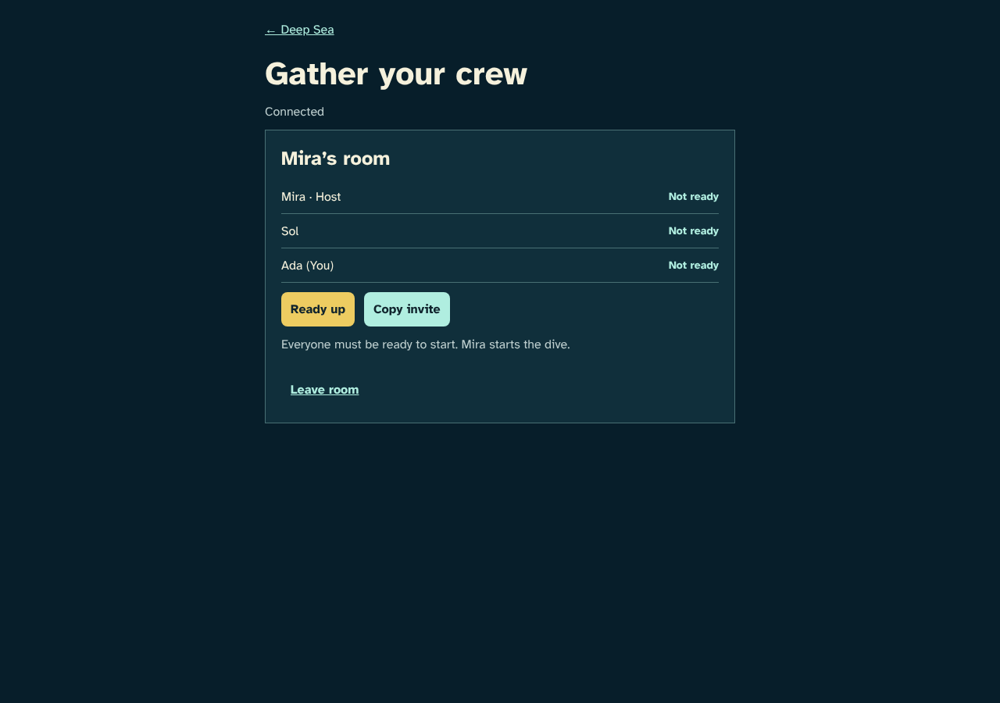
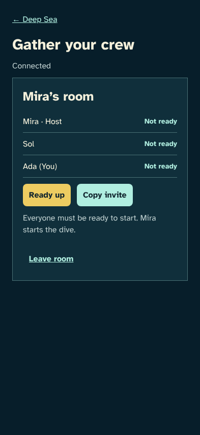

# Gather and launch a crew

> Generated by TestSteps from the passing browser scenario. Do not edit manually.

Mira creates a room from the home screen, invites friends, chooses a first diver and starts.

## host

Mira creates a room from the home screen, invites friends, chooses a first diver and starts.

## The host invites friends

- Mira is seated as host and cannot start alone.

## The host starts with the selected first diver

- The confirmed start freezes three seats and assigns Sol the first turn.

## guest

Sol joins through the invite, readies up, and sees the same saved start after reload.

## A friend joins and readies up

- Sol has a seat and can withdraw readiness, but cannot start the room.

## Reload keeps the player and confirmed start

- Sol returns to the same seat and the same first diver without a second join.

## third

Ada joins as a third player; the roster change clears earlier readiness.

## A third friend joins

- Ada is seated in the same three-person crew and all readiness has reset.

