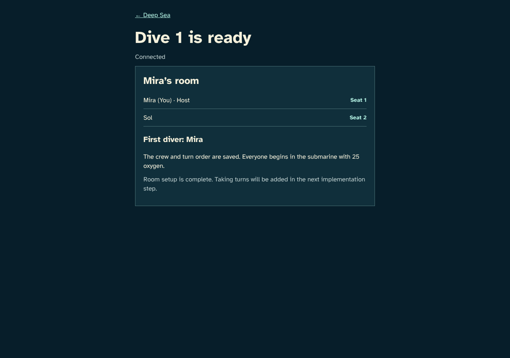
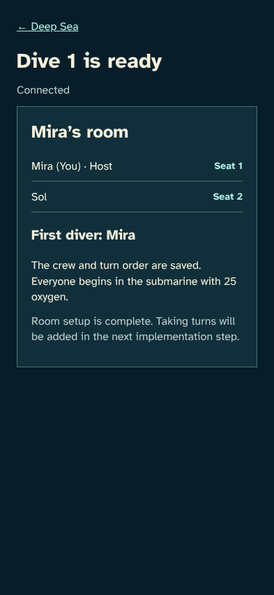
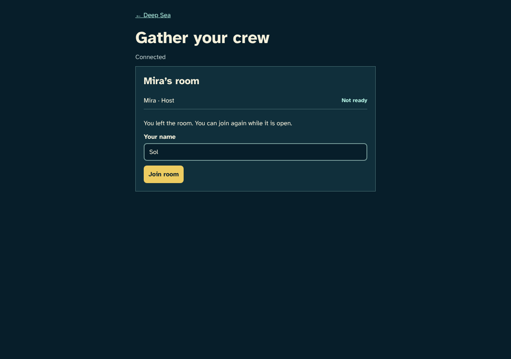
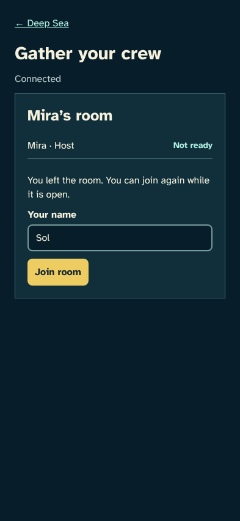
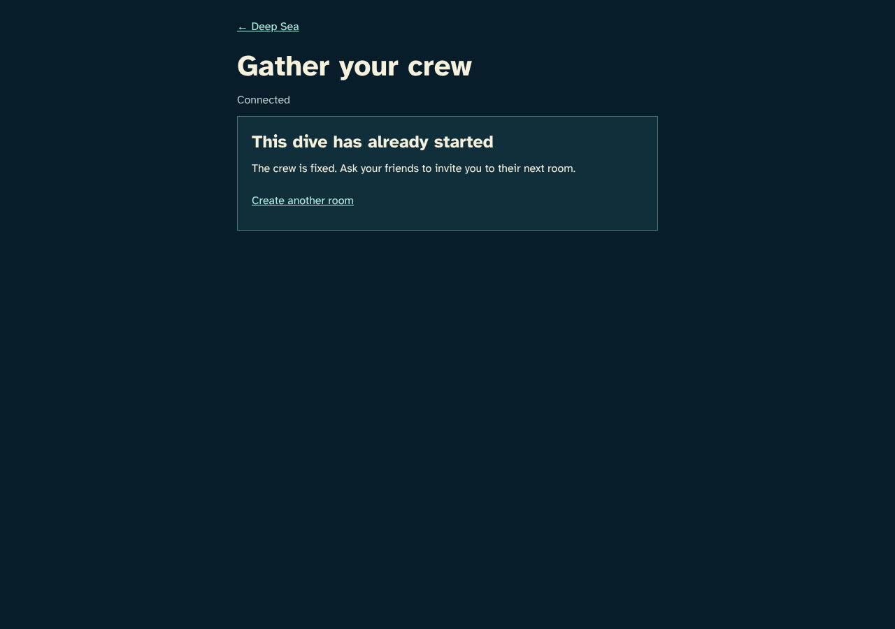
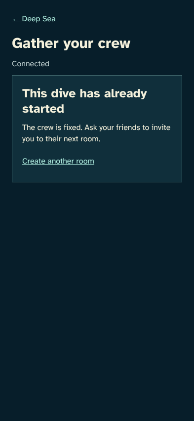

# Start with two divers

> Generated by TestSteps from the passing browser scenario. Do not edit manually.

The host starts a confirmed two-person crew after a friend leaves and rejoins.

## host

The host starts a confirmed two-person crew after a friend leaves and rejoins.

## Two ready friends start

- The saved start contains both seats and Mira as first diver.

## guest

A friend can leave an unstarted lobby and rejoin through the same invite.

## Leaving releases the seat

- The guest can rejoin and the host is alone again.

## late

A fresh browser cannot join a crew whose dive has already started.

## Late arrivals get a clear explanation

- The started room rejects a new player and offers a new room.

