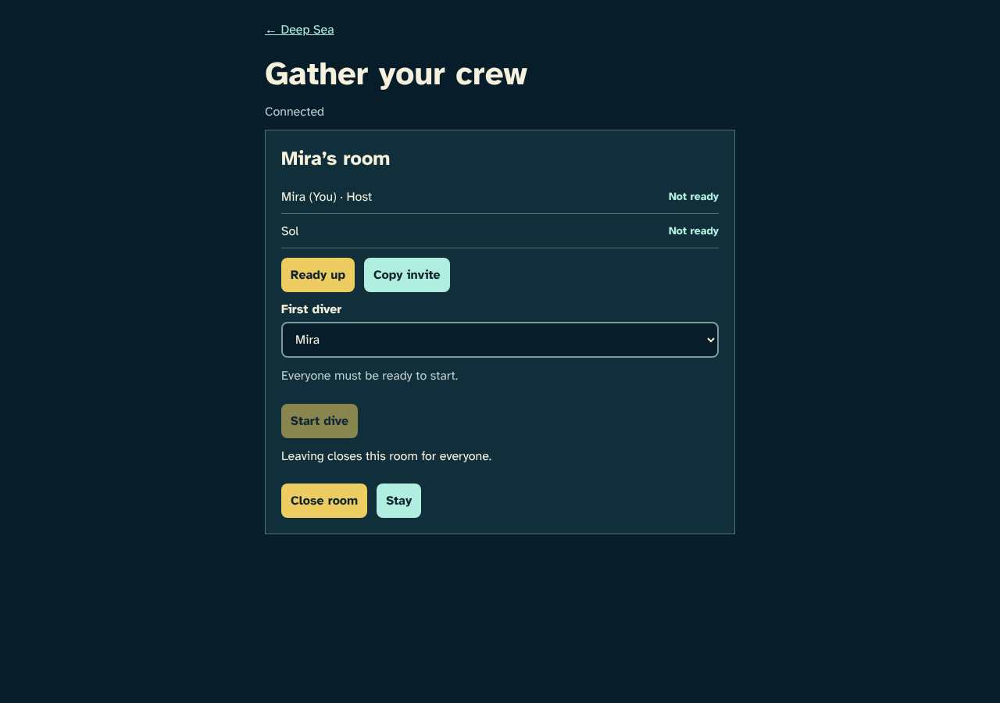
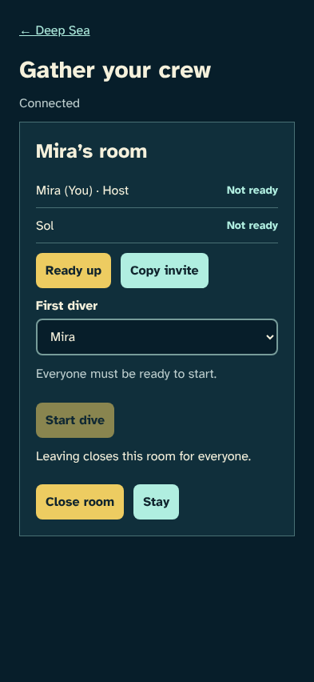
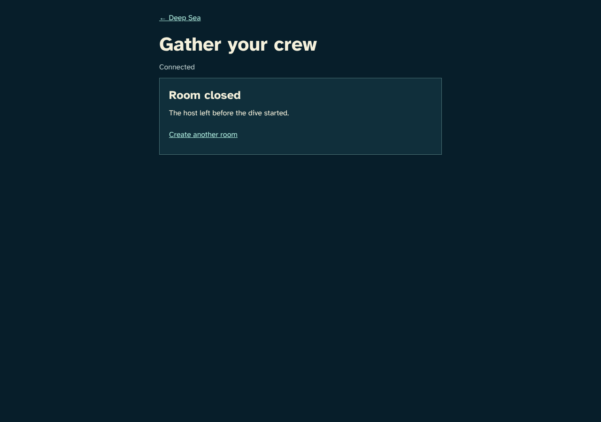

# Close an unstarted room

> Generated by TestSteps from the passing browser scenario. Do not edit manually.

The host explicitly confirms that leaving closes the room for everyone.

## host

The host explicitly confirms that leaving closes the room for everyone.

## Closing the room needs a deliberate confirmation

- The host sees who will be affected and can stay instead.

## guest

A friend sees that the room is closed and can create another room.

## The invite reflects the confirmed closure

- Both browsers show the closed room and joining is unavailable.

