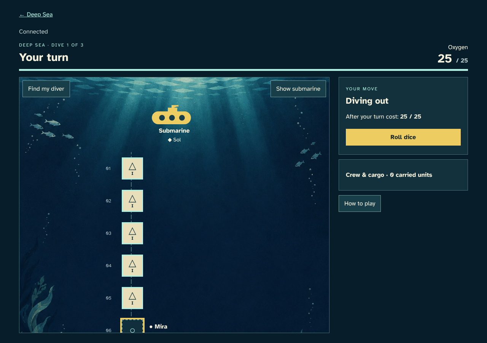
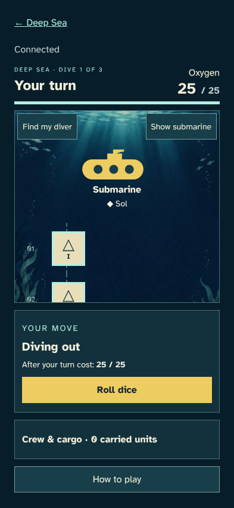

# Dive for treasure

> Generated by TestSteps from the passing browser scenario. Do not edit manually.

Mira rolls, collects treasure and observes Sol taking the next turn.

## host

Mira rolls, collects treasure and observes Sol taking the next turn.

## Mira lands on concealed treasure

- The confirmed dice move six spaces without using oxygen on an empty cargo hold.

## guest

Sol sees the confirmed move, reloads, and takes the next turn.

## Sol sees the pickup and takes over

- The shared path now has an empty sixth space and the next player can roll.

