# Dive for treasure

> Generated by TestSteps from the passing browser scenario. Do not edit manually.

Mira rolls, collects treasure and observes Sol taking the next turn.

## host

Mira rolls, collects treasure and observes Sol taking the next turn.

## Mira lands on concealed treasure

- The confirmed dice move six spaces without using oxygen on an empty cargo hold.

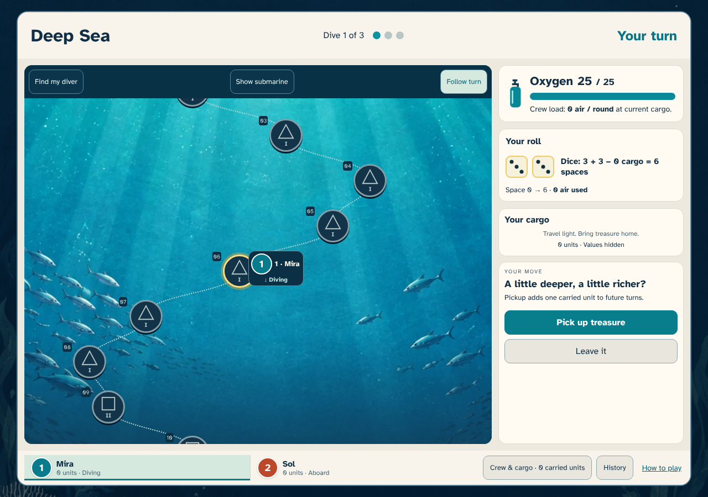

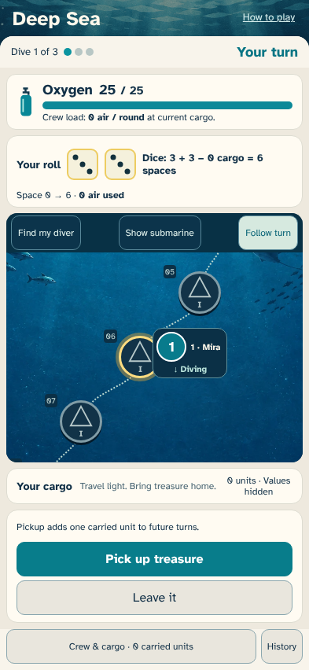

## Look back toward the sunlit submarine

- The submarine is visible at the surface while the treasure decision remains available.

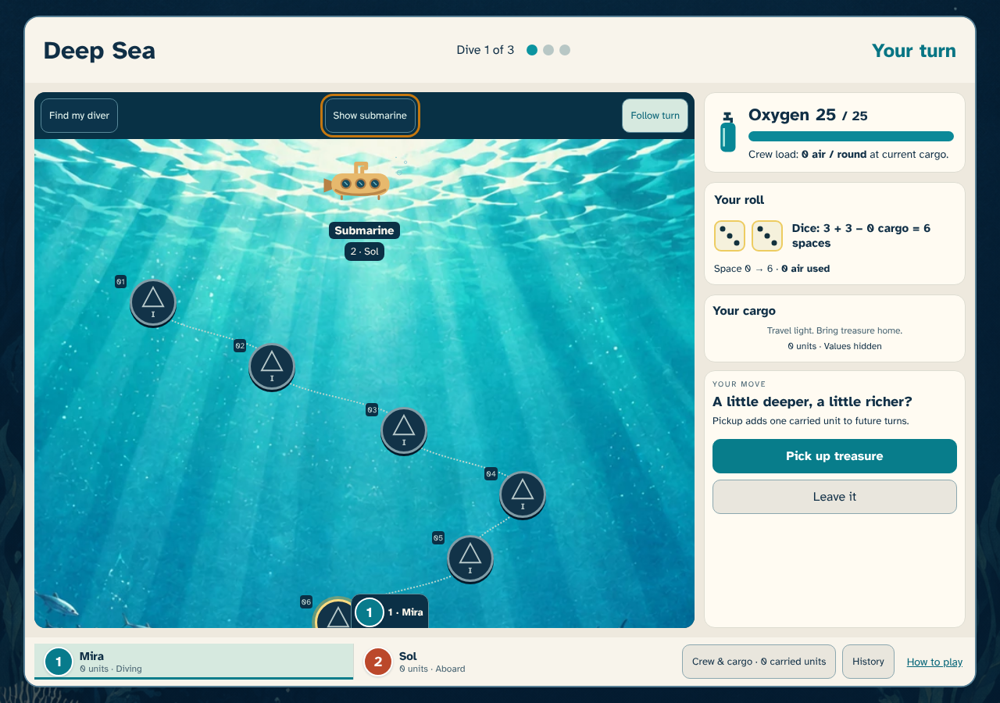

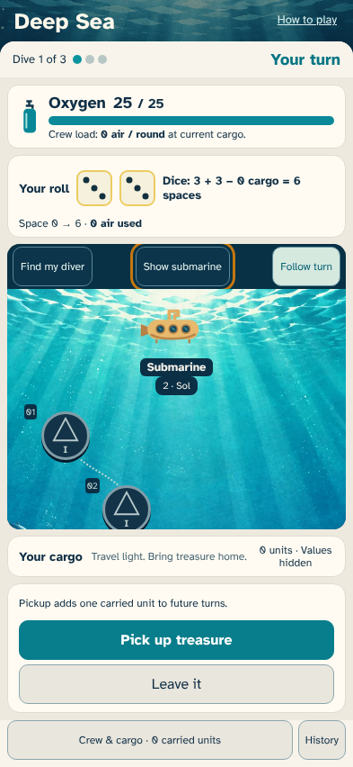

## Explore the darker water below

- Level III treasure is visible deeper down; the submarine scrolls away and the landing controls stay available.

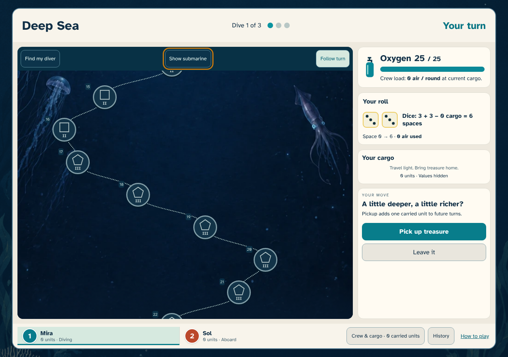

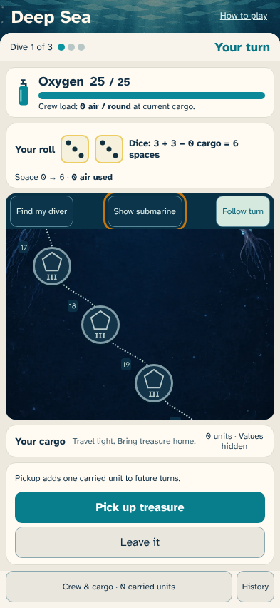

## Explore the bioluminescent deep

- Level IV treasure is visible in the abyss while the same pickup or leave decision stays available.

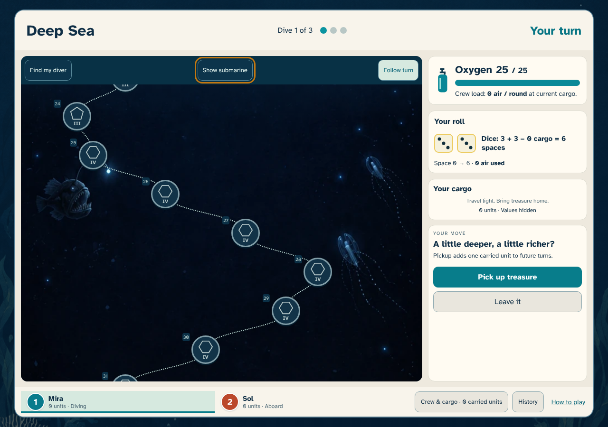

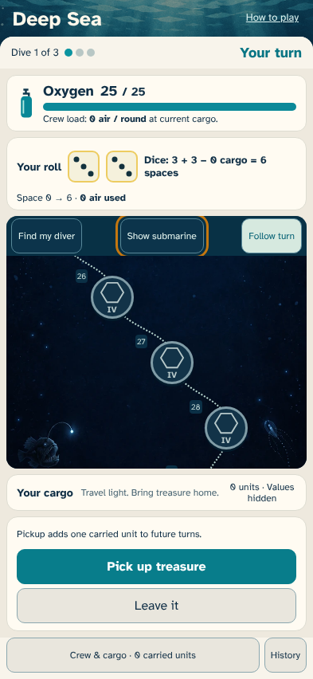

## Reach the midnight seabed

- The last level IV treasure and seabed are visible, with the same six-space roll and unchanged oxygen.

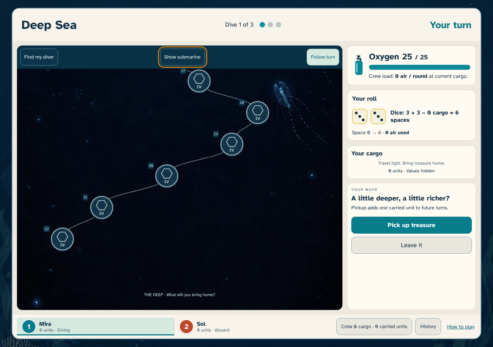

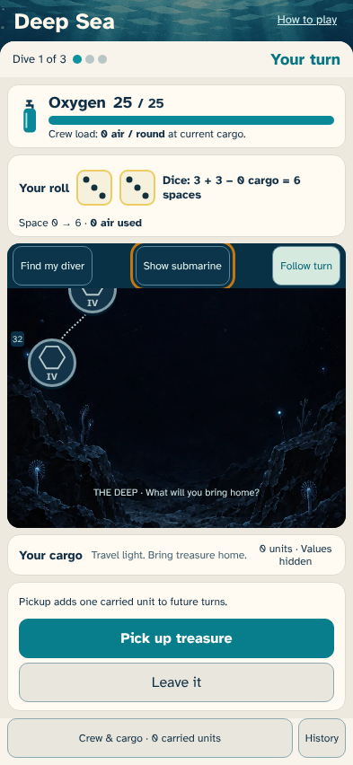

## guest

Sol sees the confirmed move, reloads, and takes the next turn.

## Follow Mira’s roll and air use

- Sol sees Mira’s dice, destination and zero air charge while she chooses treasure.

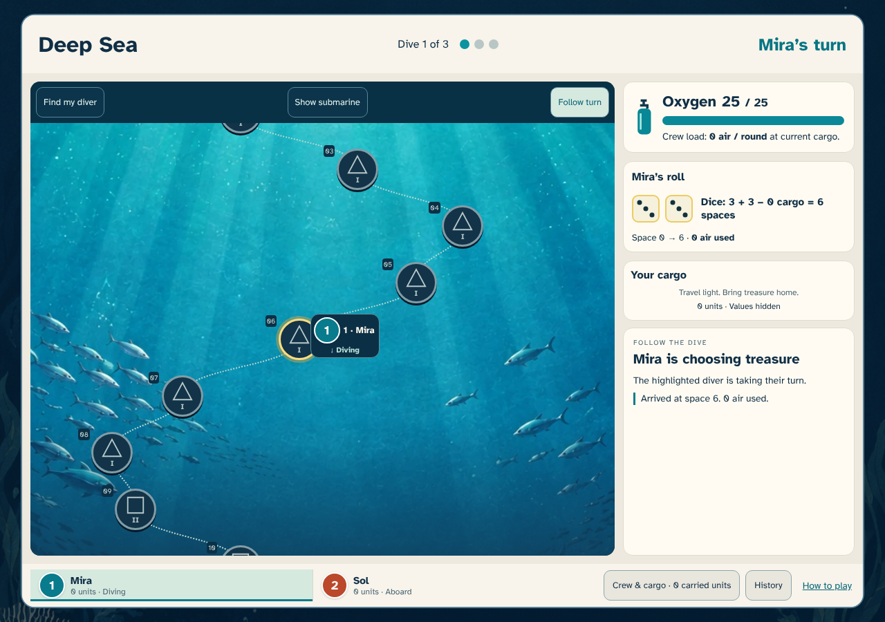

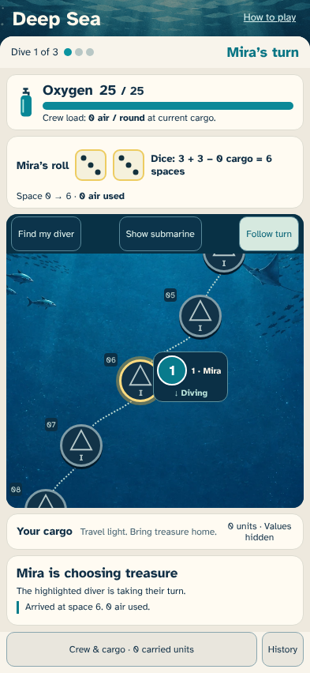

## Sol sees the pickup and takes over

- The shared path now has an empty sixth space and the next player can roll.

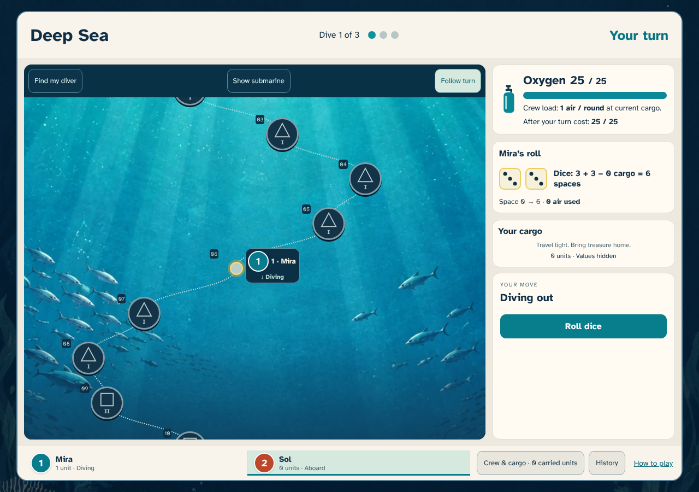

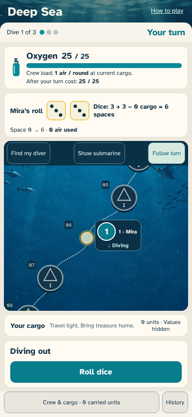
