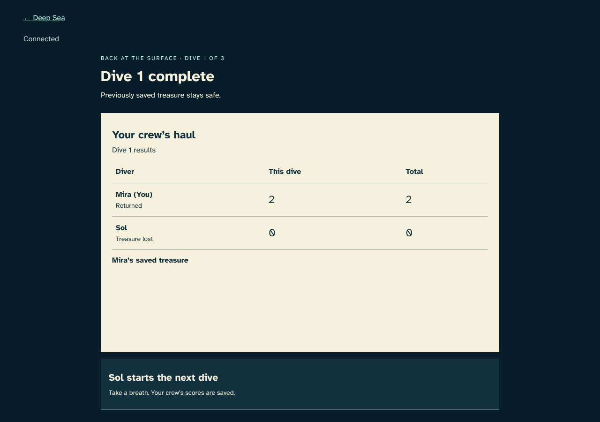
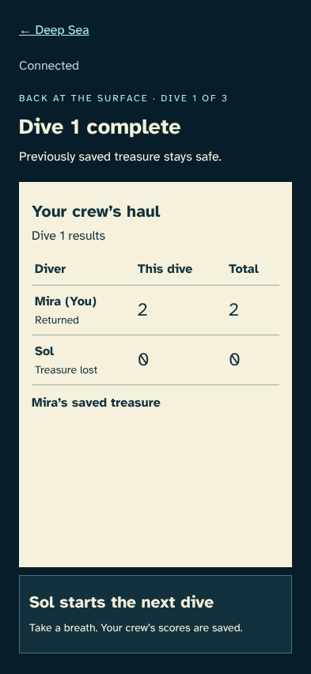
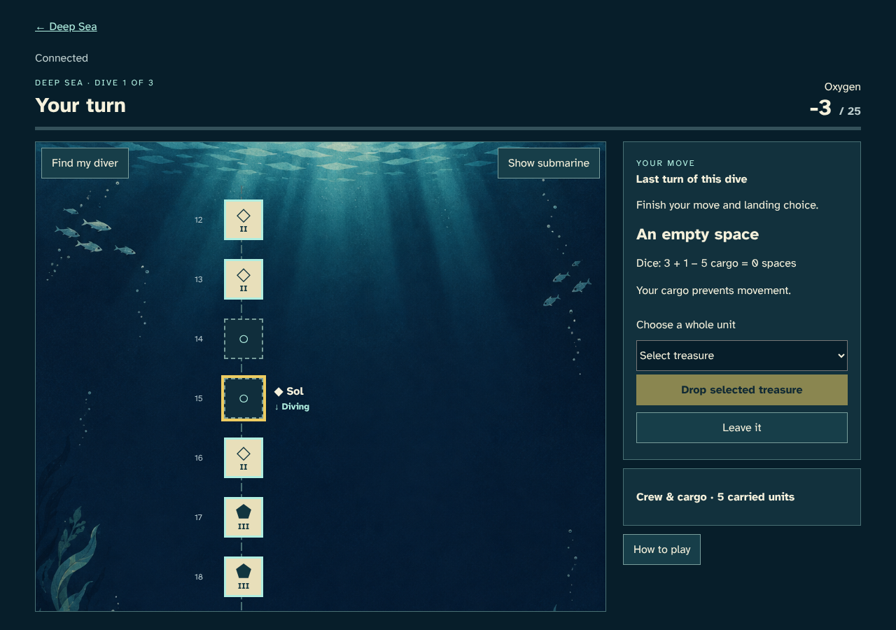
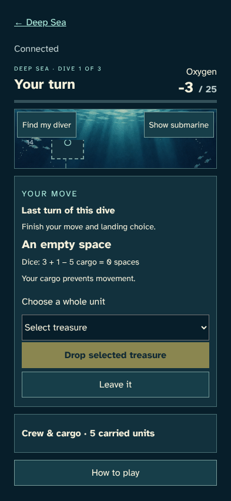
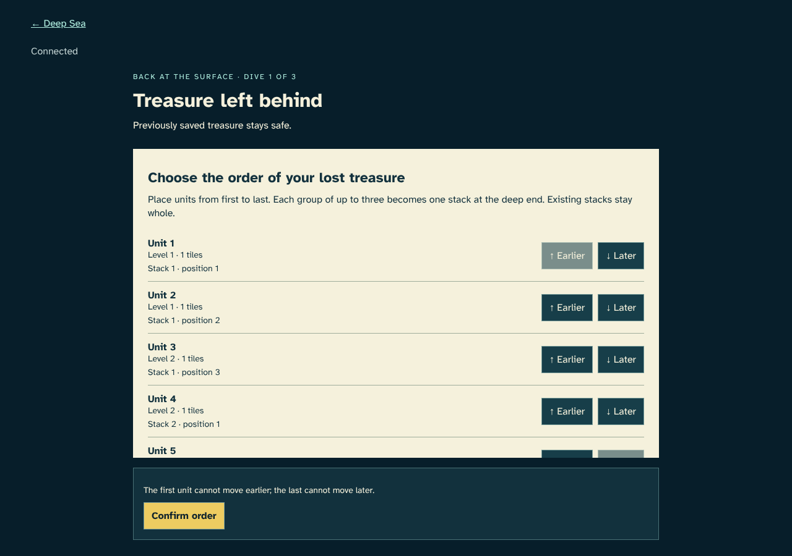
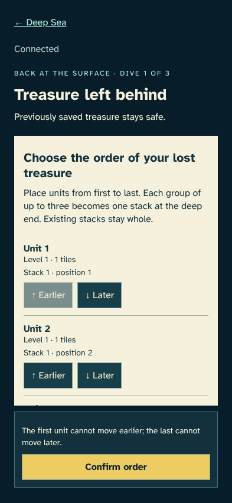

# Bring treasure home

> Generated by TestSteps from the passing browser scenario. Do not edit manually.

Mira returns safely and follows Sol through the end of the dive.

## host

Mira returns safely and follows Sol through the end of the dive.

## Safe treasure scores and lost treasure does not

- Both clients see the same returned and lost outcomes, separate dive and cumulative scores, and next starter.

## guest

Sol stays underwater, finishes the last turn and orders lost cargo with the keyboard.

## Finish the last oxygen-exhausting turn

- Oxygen is below zero but Sol still has the legal landing choice.

## Choose how lost cargo forms stacks

- Five whole units remain concealed, with grouping guidance and keyboard controls.

