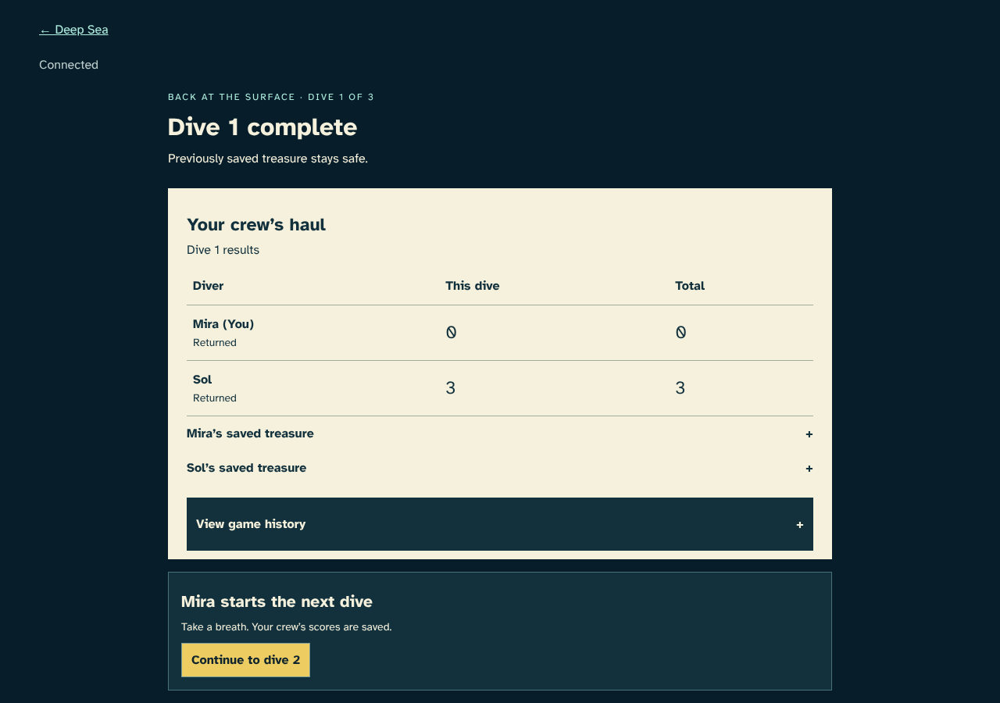
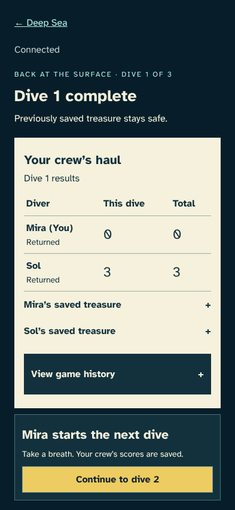
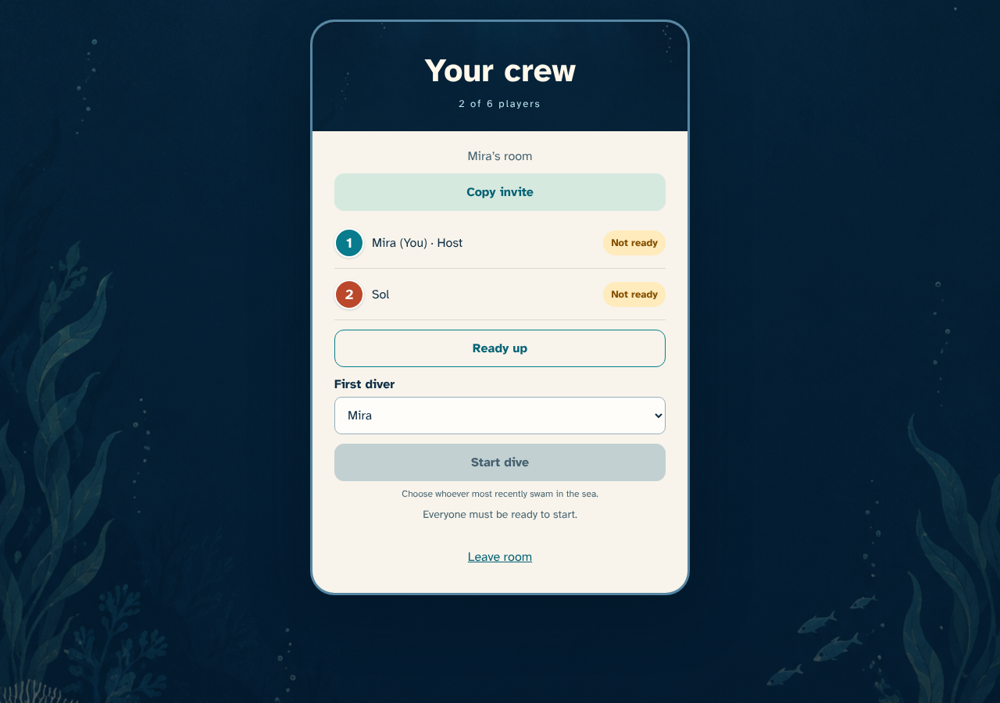
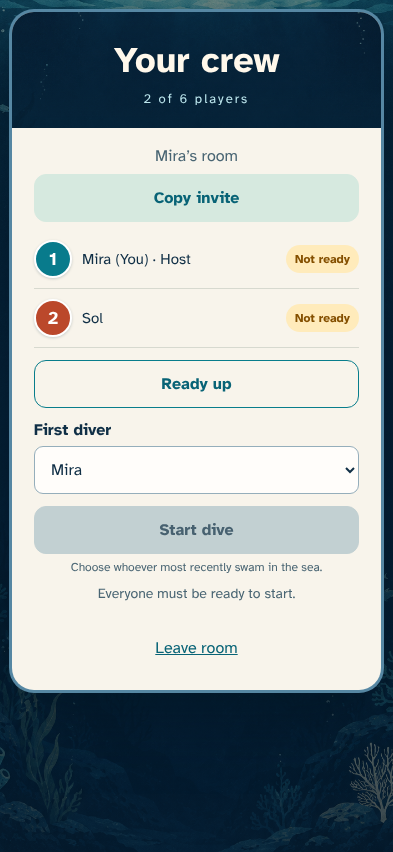
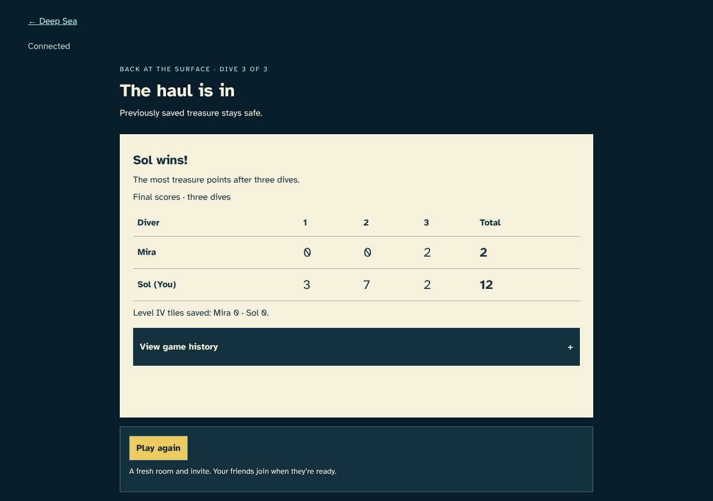
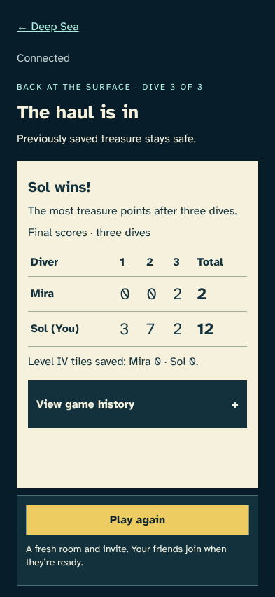
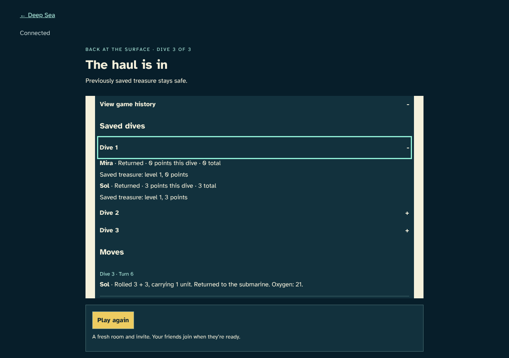
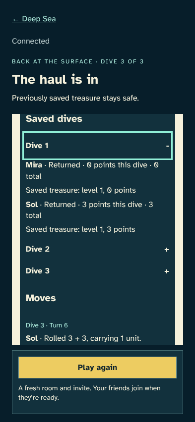

# Three dives together

> Generated by TestSteps from the passing browser scenario. Do not edit manually.

Mira and Sol bring treasure home over three dives, then create a fresh room.

## host

Mira and Sol bring treasure home over three dives, then create a fresh room.

## A safe first dive banks both hauls

- Both returned, and only safely banked values are revealed.

## Play again starts a new invitation

- The original result survives reload, and both friends join a fresh unready lobby with the host name retained.

## guest

Sol sees all three dive scores and can return to the completed result after another room is created.

## Every dive contributes to the final score

- Sol wins with 12 points, Mira has 2, and both clients show the same three-dive totals.

## Earlier hauls remain inspectable

- The first dive still reveals only its safely returned treasure and keeps the three-dive result available.

