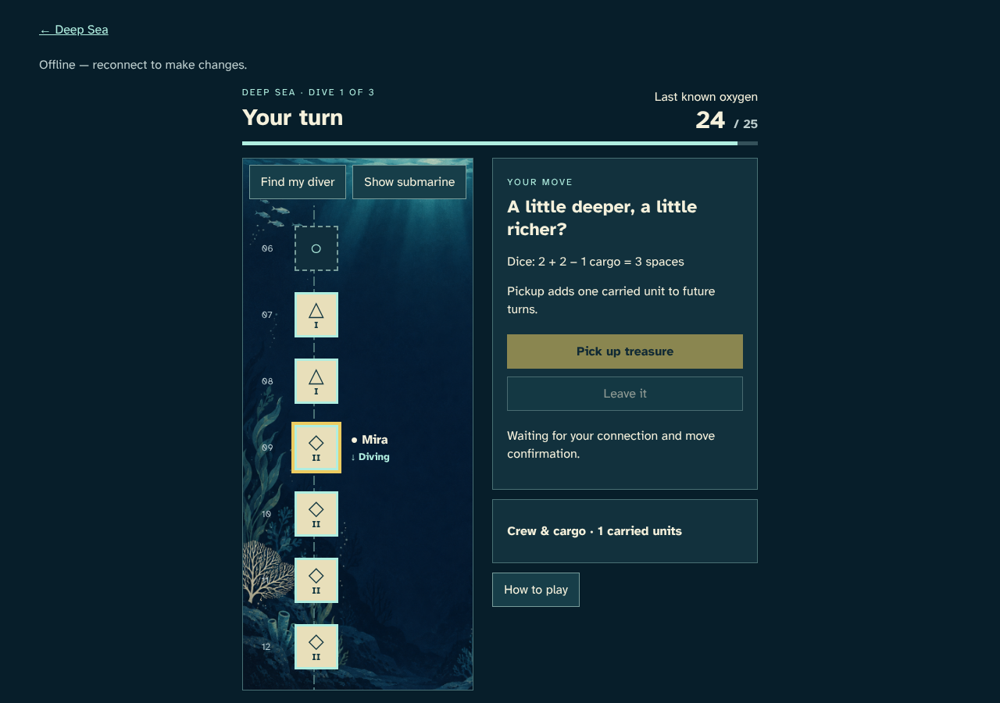
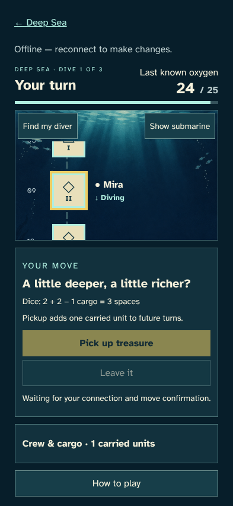
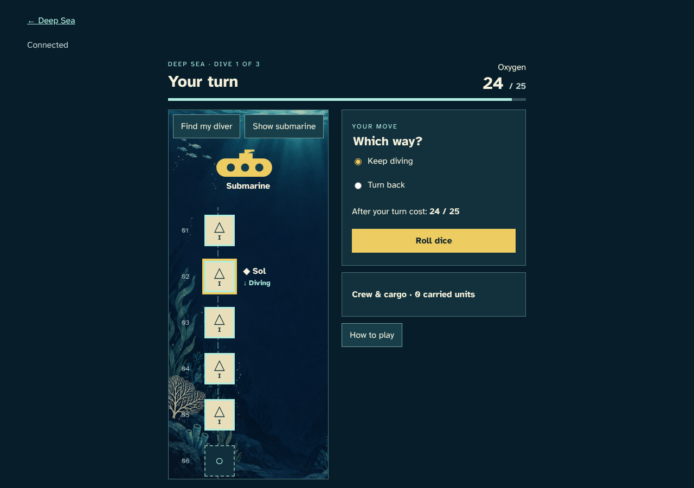
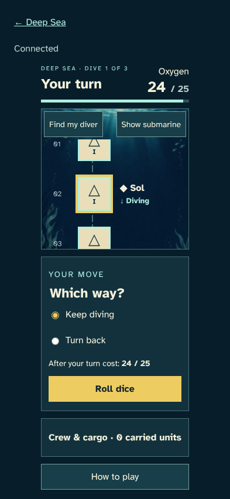
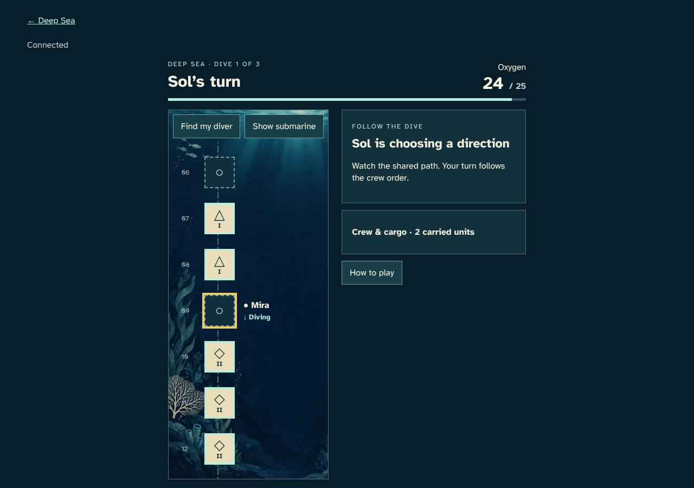
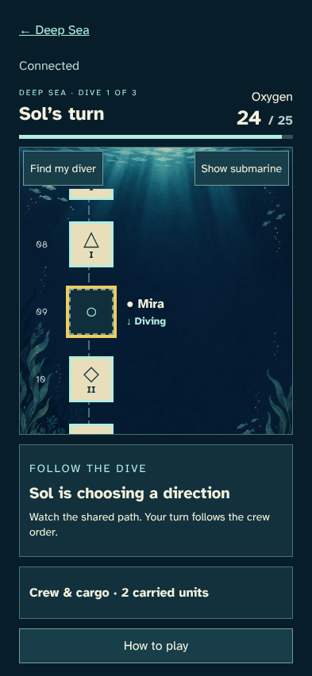

# A move survives interruption

> Generated by TestSteps from the passing browser scenario. Do not edit manually.

A lost reply and competing tabs never repeat an oxygen charge.

## host

A lost reply and competing tabs never repeat an oxygen charge.

## The last confirmed board stays visible

- Offline controls stop new moves while oxygen stays at 24.

## guest

The other player sees the same confirmed oxygen and cargo.

## The other diver sees one oxygen charge

- Sol can take the next turn with the same shared total.

## tab

Both tabs restore one seat and the accepted dice.

## Reload keeps the accepted move

- The same seat, oxygen and next player return without another roll.

