# A full crew

> Generated by TestSteps from the passing browser scenario. Do not edit manually.

Five seated friends see only one final join.

## mira

Five seated friends see only one final join.

## The crew has exactly six seats

- All seated friends see the same six names.

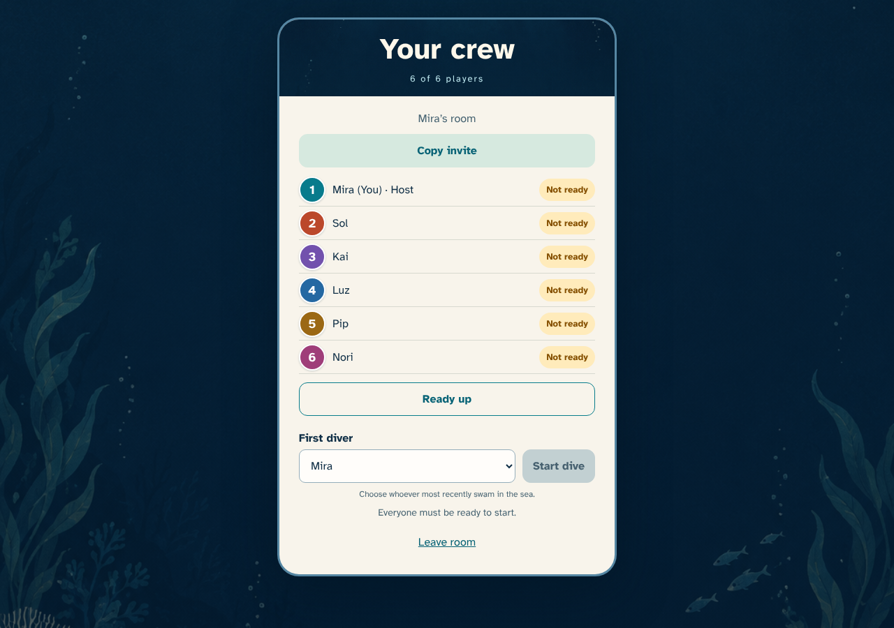

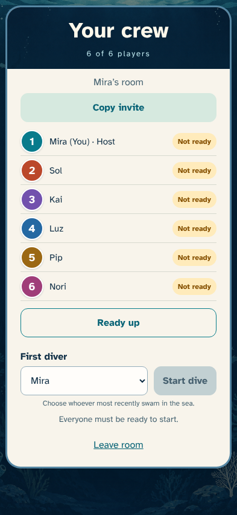

## The full crew is ready to dive

- The invite confirmation and six ready seats fit alongside an enabled Start dive.

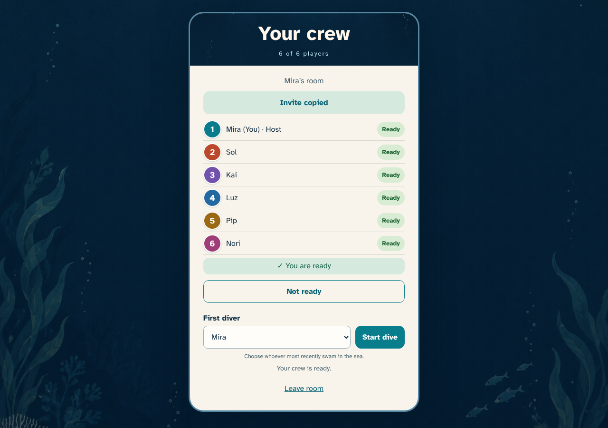

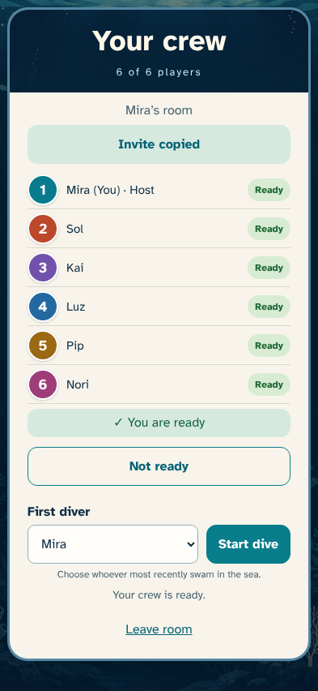

## Every diver is identifiable during play

- The crew inspector names all six divers, distinguishes the local seat, and shows concealed cargo separately from saved points.

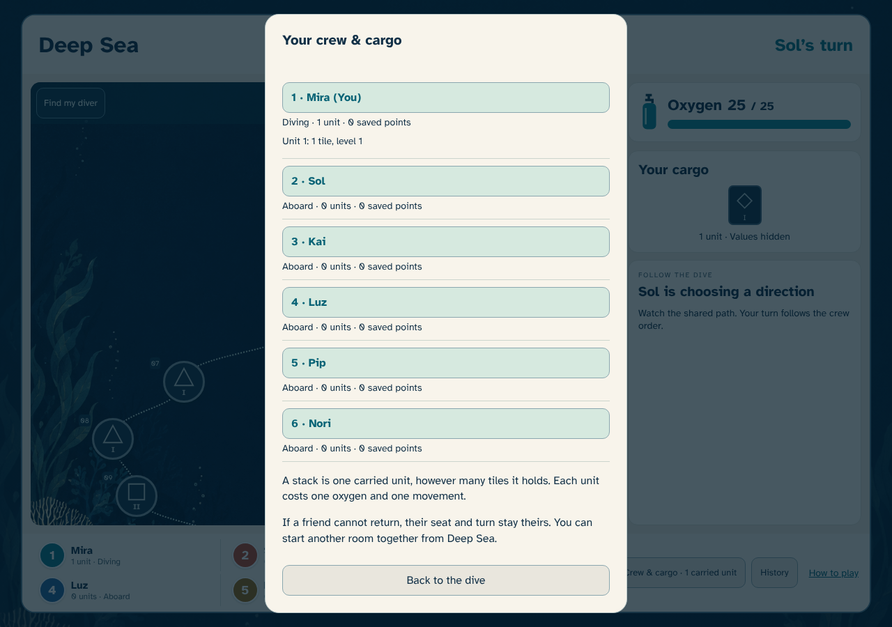

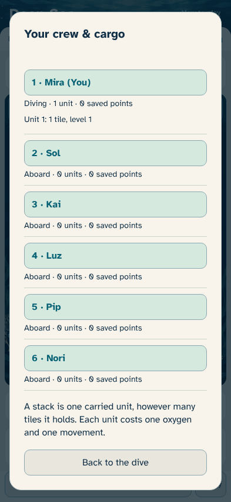

## sol

Five seated friends see only one final join.

## The crew has exactly six seats

- All seated friends see the same six names.

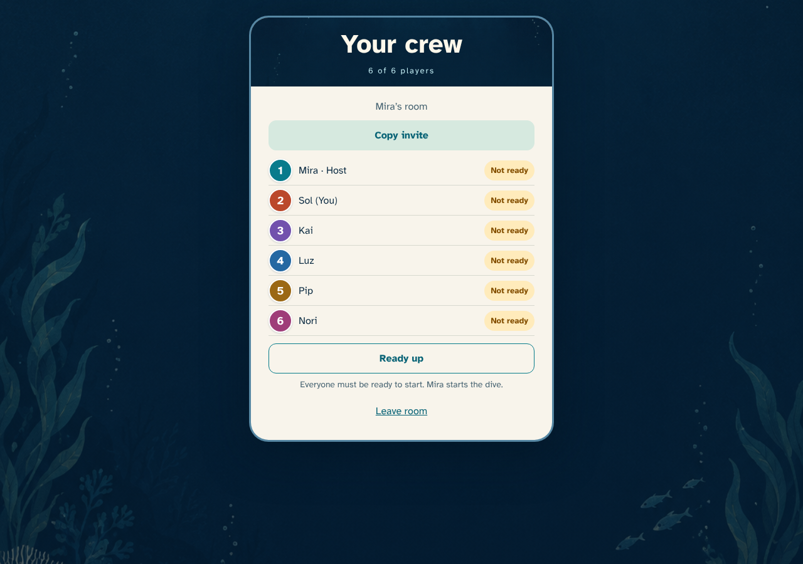

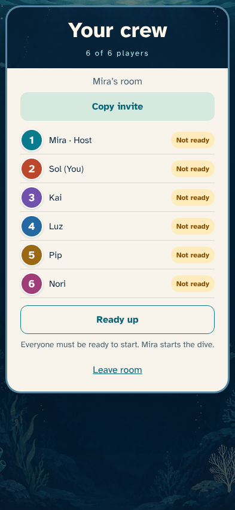

## kai

Five seated friends see only one final join.

## The crew has exactly six seats

- All seated friends see the same six names.

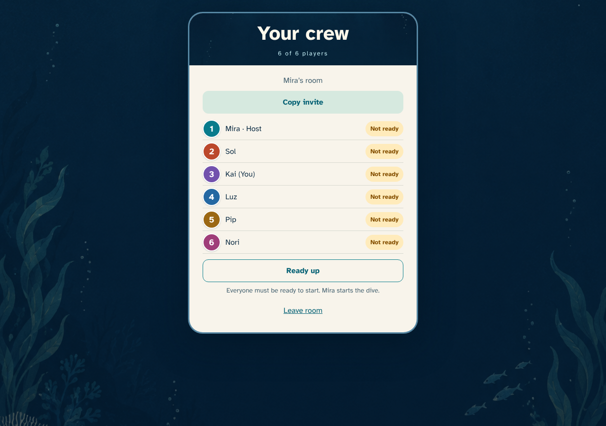

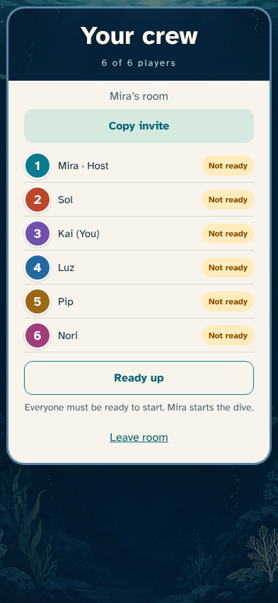

## luz

Five seated friends see only one final join.

## The crew has exactly six seats

- All seated friends see the same six names.

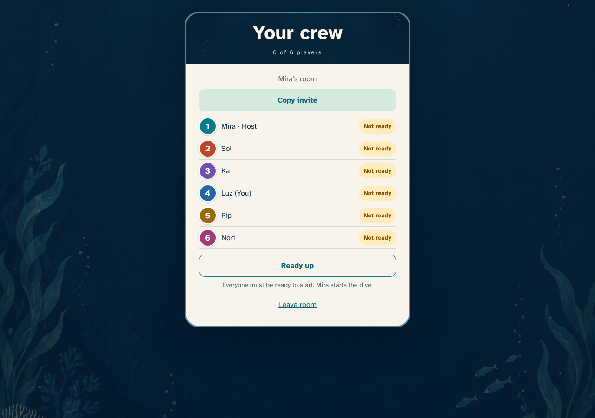

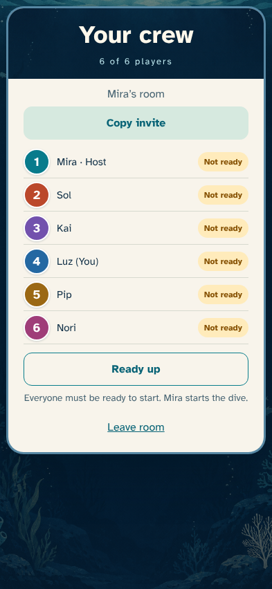

## pip

Five seated friends see only one final join.

## The crew has exactly six seats

- All seated friends see the same six names.

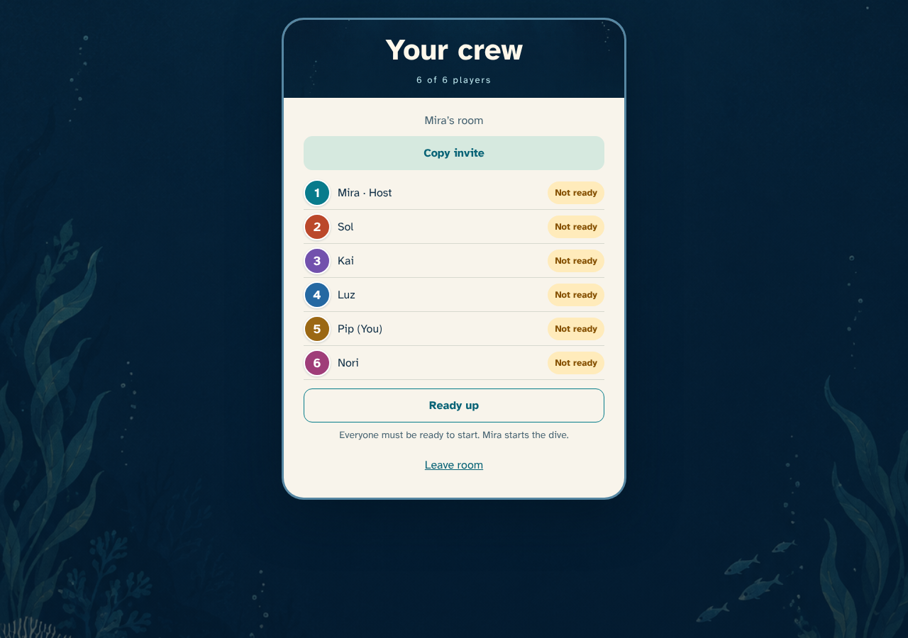

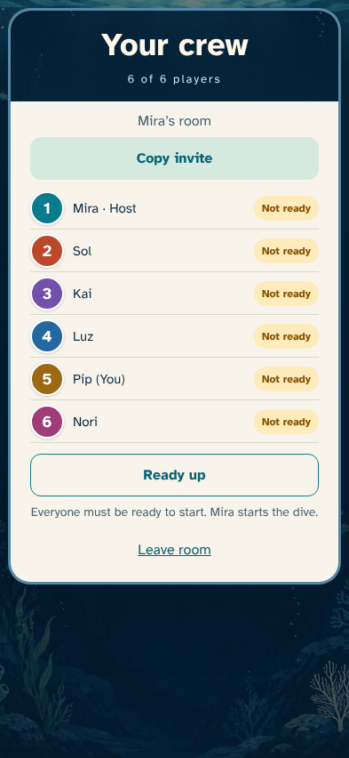

## winner

The successful friend joins once.

## One final diver joins

- The winner has exactly one seat and readiness controls.

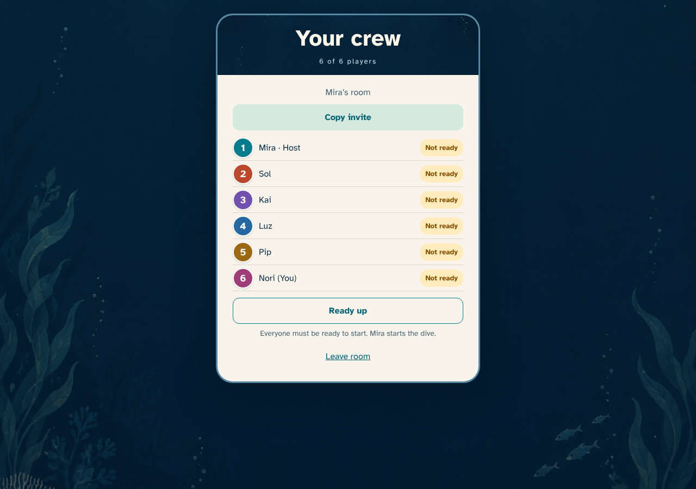

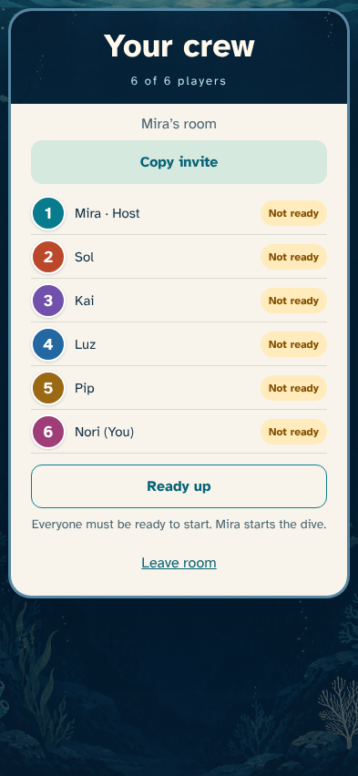

## loser

The other friend gets a clear new-room option.

## The other invitation cannot claim a seat

- The losing friend is not seated and can create another room.

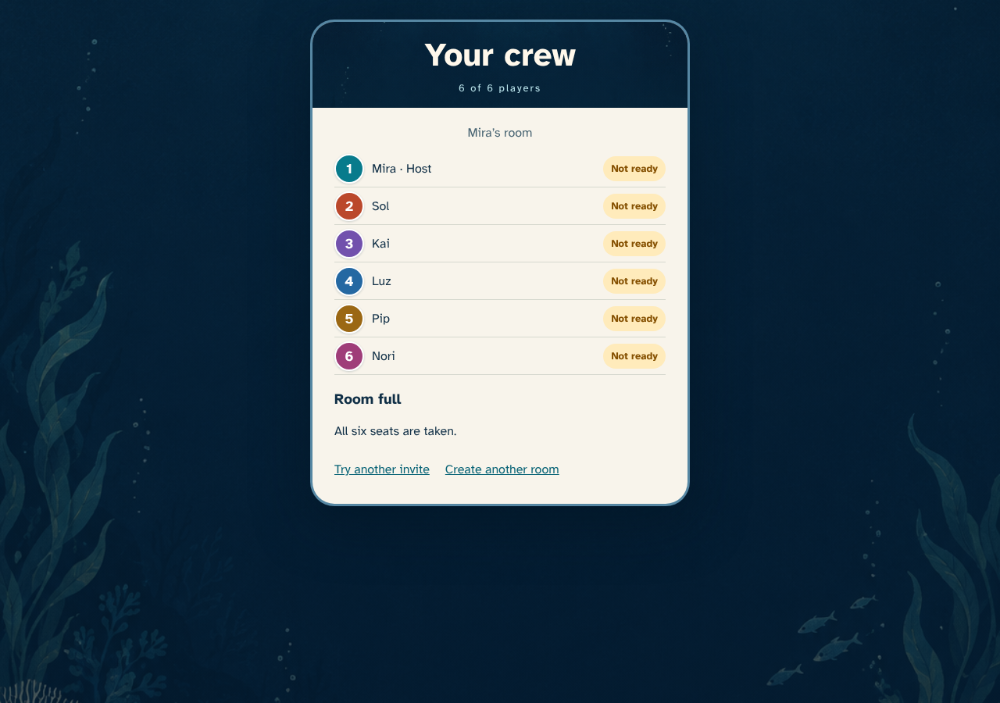

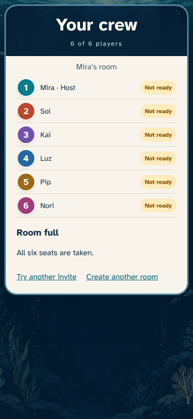
