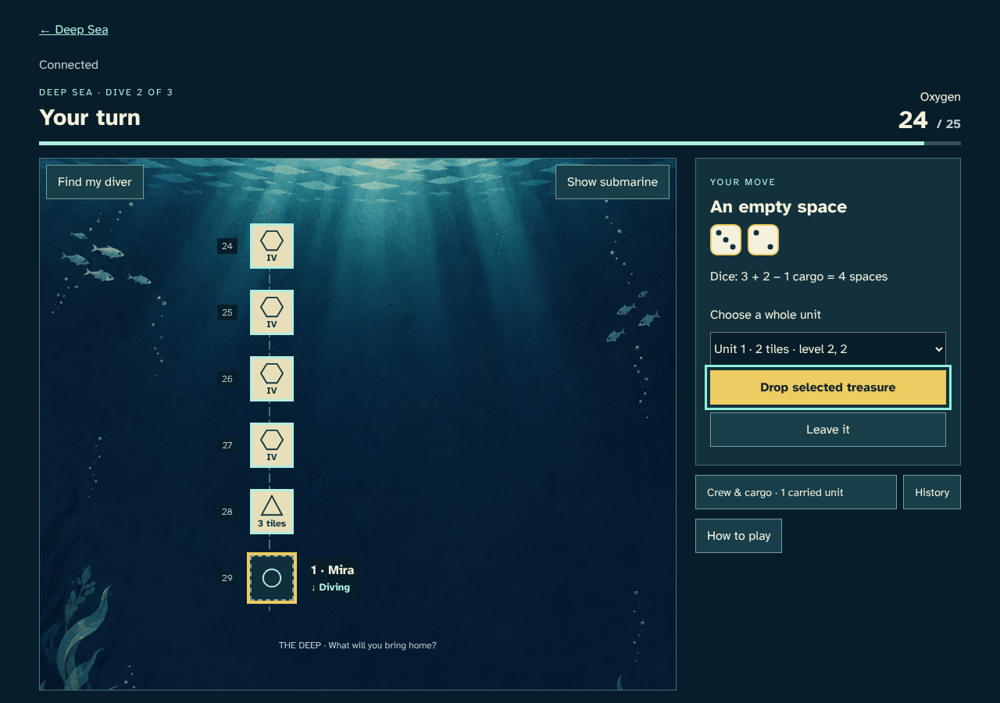
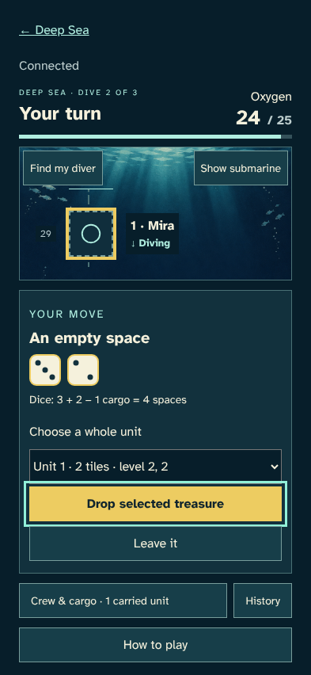
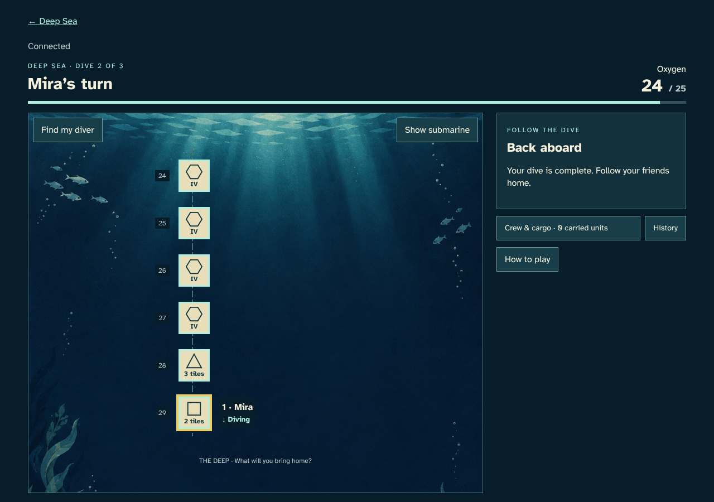
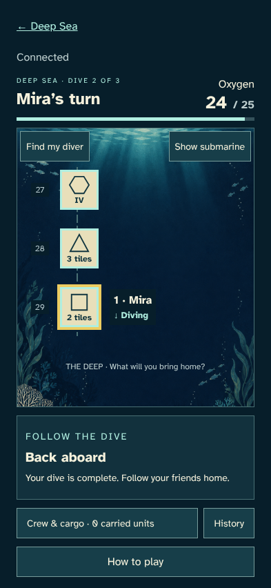

# A whole stack travels together

> Generated by TestSteps from the passing browser scenario. Do not edit manually.

Mira loses treasure, finds its stack on the next dive, and drops the entire unit with the keyboard.

## host

Mira loses treasure, finds its stack on the next dive, and drops the entire unit with the keyboard.

## The stack is one cargo choice

- Both concealed tiles are selected as one unit; no individual tile can be dropped.

## guest

Sol sees the complete two-tile stack returned to an empty space.

## Both tiles return to the same space

- The other browser sees a concealed two-tile stack on the shared path.

