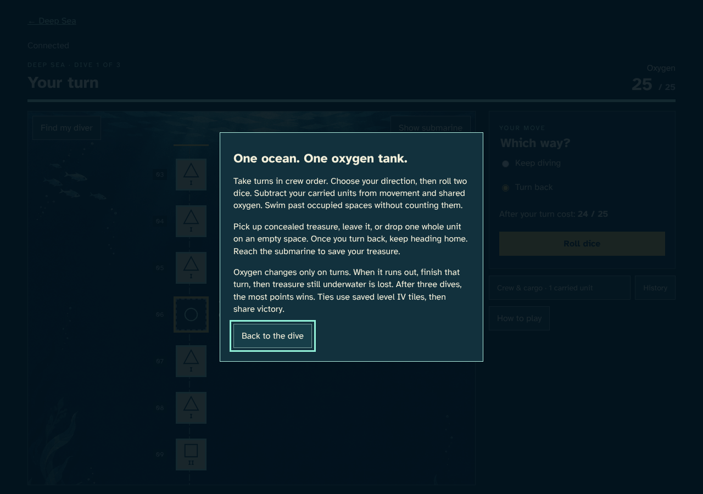
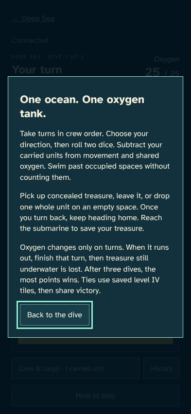
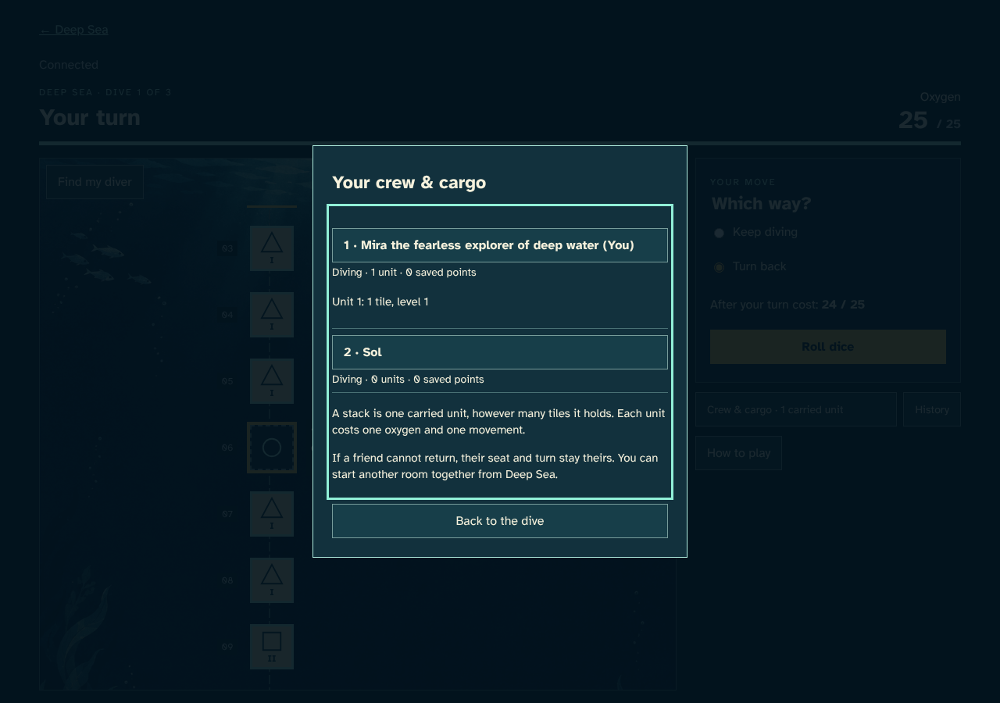
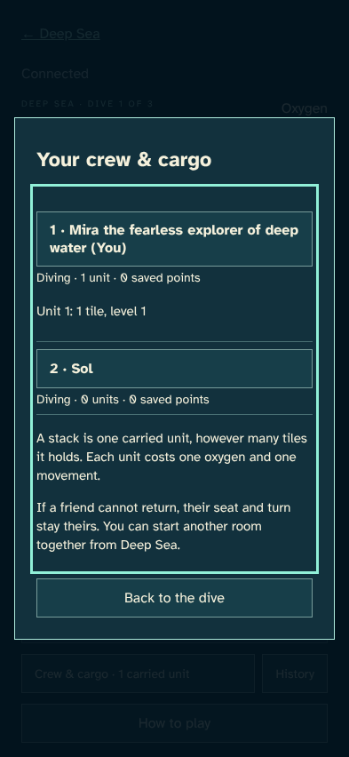
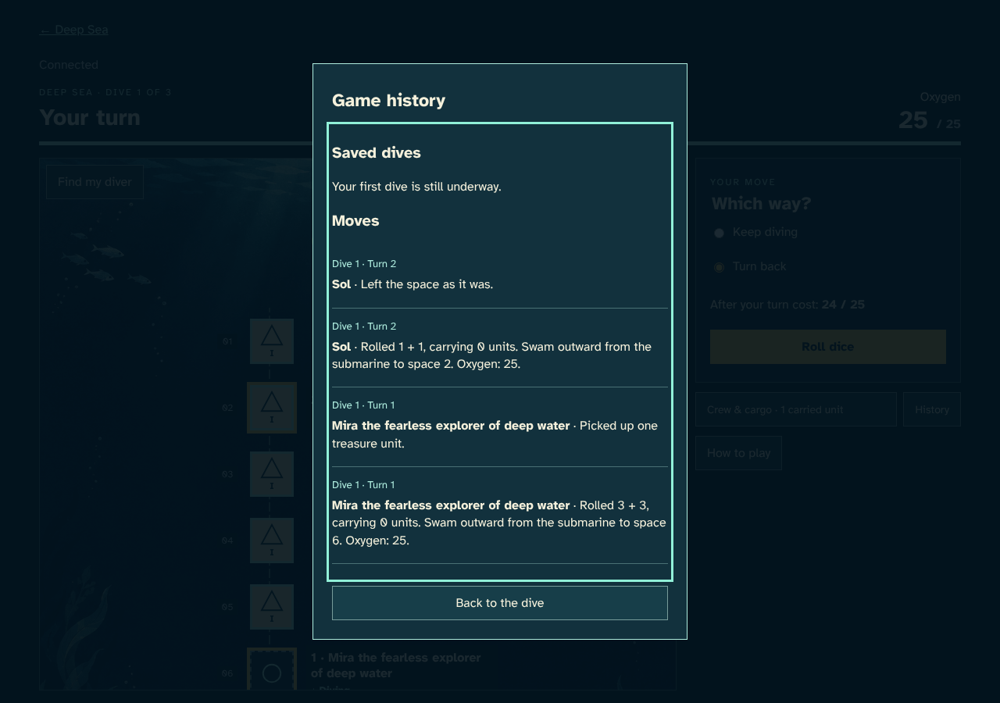
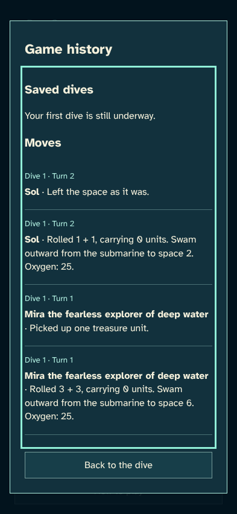

# Every control has a keyboard path

> Generated by TestSteps from the passing browser scenario. Do not edit manually.

A long player name stays readable while help, cargo and history preserve the current move.

## host

A long player name stays readable while help, cargo and history preserve the current move.

## Help does not discard the chosen direction

- The named dialog explains movement and oxygen in player language and has a keyboard close control.

## Cargo shows units and tiles without a peek

- The held unit is concealed and the roster has readable long names and statuses.

## Confirmed moves have a readable history

- History names the divers and their actions without exposing hidden values or event data.

## guest

Sol pastes a real invitation and joins using native form controls.

## An invitation leads to the right crew

- Sol joins the invited room; the long host name wraps without blocking controls.

